# AWS Capstone Project

A team capstone project building and deploying a web application on AWS using Free Tier resources. This repository documents our environment setup, infrastructure, and development workflow.

**Repository:** [GeekKwame/aws-capstone-project](https://github.com/GeekKwame/aws-capstone-project)

---

## Phase 1: Project Setup & Environment Configuration

**Challenge:** Set up all tools, accounts, and repositories for the project.

### Activities Completed

| Activity | Status |
|----------|--------|
| Create and configure AWS Free Tier account; set up IAM users with least-privilege permissions | Done |
| Install and configure AWS CLI locally with named profiles | Done |
| Create a GitHub repository with proper branching strategy | Done |
| Set up a Trello board with Backlog, In Progress, Review, Done columns | Done |
| Launch an EC2 instance and configure security groups for HTTP/HTTPS | Done |
| Create an S3 bucket for static assets | Done |
| Document the project environment setup in this README | Done |

---

## Phase 2: Web Application Development & EC2 Deployment

**Challenge:** Build a functional frontend application and host it on the EC2 web server.

### Task 1 — Host Web App on EC2 Instance

| Activity | Status |
|----------|--------|
| Develop the Student Study Planner frontend (HTML, CSS, JavaScript) | Done |
| Connect to the EC2 instance via SSH | Done |
| Install and enable Nginx on Amazon Linux 2023 | Done |
| Upload application files to the instance via SCP | Done |
| Deploy files to `/var/www/study-planner` and set Nginx ownership | Done |
| Configure Nginx to serve the app and expose a health check endpoint | Done |
| Verify the application is reachable over HTTP in a browser | Done |

A simple web application called **Student Study Planner** was developed using HTML, CSS, and JavaScript. The application allows users to manage study tasks and monitor progress through an intuitive interface, demonstrating the successful development of a functional frontend application.

#### Web Application

The app lives in the `app/` directory and includes:

| File | Purpose |
|------|---------|
| `index.html` | Main UI — task form, progress tracker, daily motivation |
| `css/styles.css` | Layout, theming (light/dark), responsive styles |
| `js/app.js` | Task CRUD, filtering, localStorage persistence |
| `js/config.js` | S3 logo URL and app configuration |
| `health.html` | Plain-text health check response for load balancer probes |

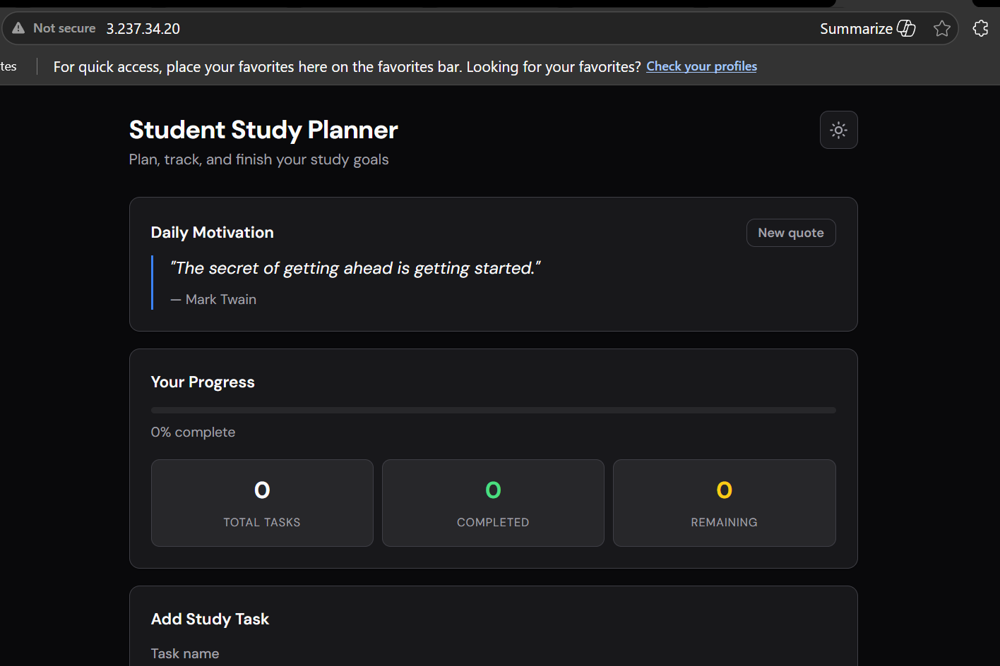

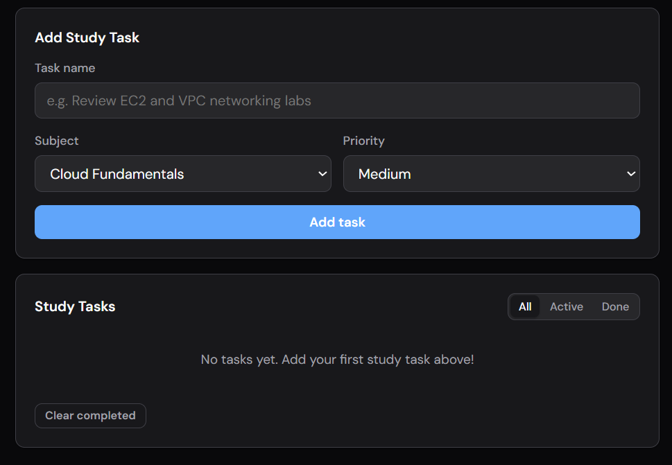

#### SSH Connection to EC2

Connected to the Capstone-WebServer instance using the team SSH key pair:

```powershell
ssh -i eddie-key.pem ec2-user@3.237.34.20
```

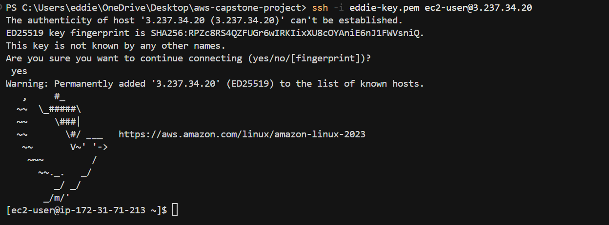

#### Install Nginx

Nginx was installed, enabled at boot, and started on Amazon Linux 2023:

```bash
sudo dnf install -y nginx
sudo systemctl enable nginx
sudo systemctl start nginx
```

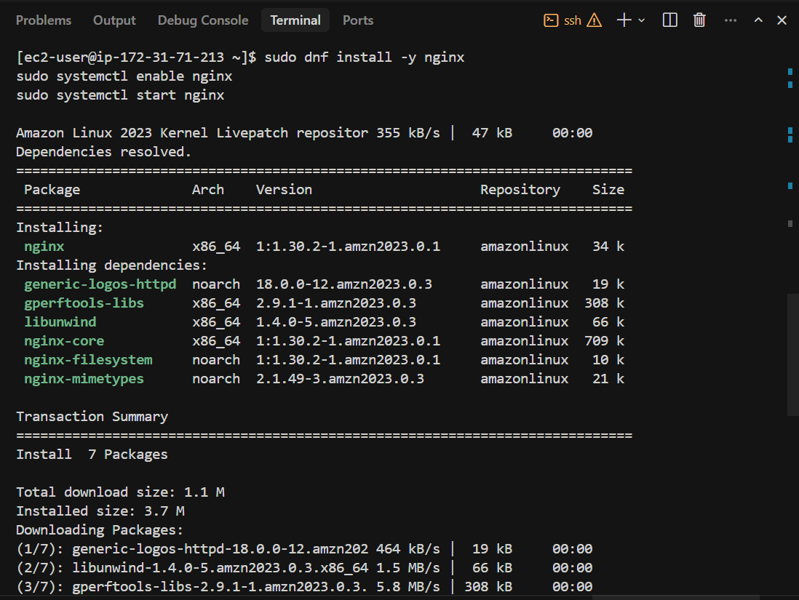

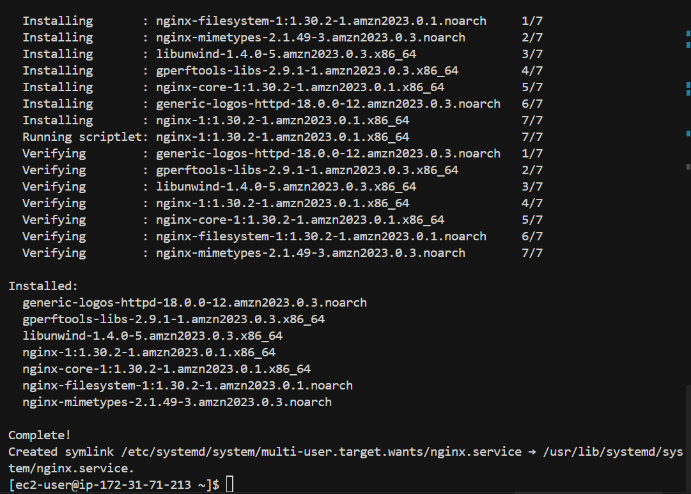

#### Upload Application Files

Application source files were copied from the local workstation to the instance using SCP:

```powershell
scp -i eddie-key.pem -r app/* ec2-user@3.237.34.20:/tmp/study-planner/
```

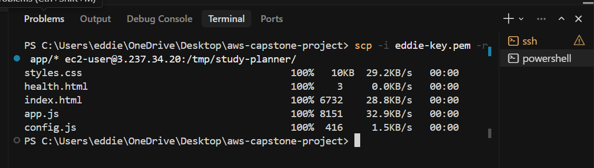

#### Deploy to Web Root

On the instance, files were moved into the Nginx document root and ownership was set for the `nginx` user:

```bash
sudo mkdir -p /var/www/study-planner
sudo cp -r /tmp/study-planner/* /var/www/study-planner/
sudo chown -R nginx:nginx /var/www/study-planner
```

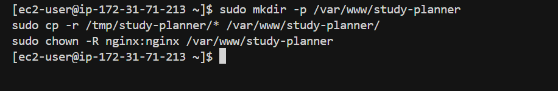

#### Nginx Site Configuration

A site block was created at `/etc/nginx/conf.d/study-planner.conf` to serve the SPA with a dedicated health check:

```nginx
server {
    listen 80;
    server_name _;
    root /var/www/study-planner;
    index index.html;

    location / {
        try_files $uri $uri/ /index.html;
    }

    location = /health.html {
        access_log off;
        return 200 "OK\n";
        add_header Content-Type text/plain;
    }
}
```

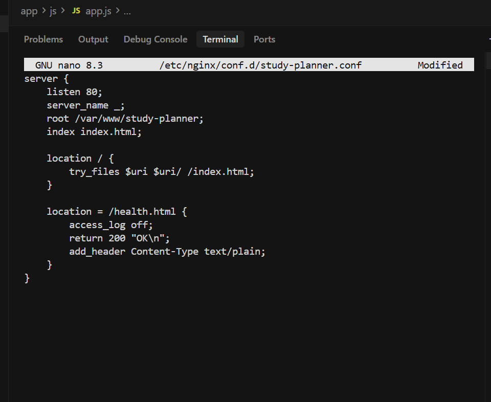

The configuration was validated and Nginx was reloaded:

```bash
sudo nginx -t
sudo systemctl reload nginx
```

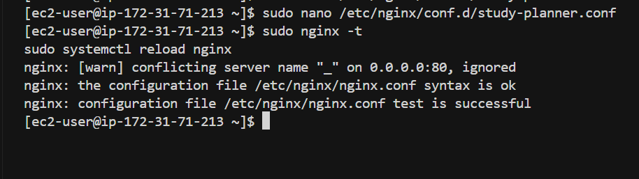

#### Live Verification

The application is live at **http://3.237.34.20** and serves the Student Study Planner UI over HTTP (port 80).

| Property | Value |
|----------|-------|
| Web root | `/var/www/study-planner` |
| Nginx config | `/etc/nginx/conf.d/study-planner.conf` |
| Public URL | `http://3.237.34.20` |
| Health check | `http://3.237.34.20/health.html` |

### Task 2 — Configure Target Group for EC2

| Activity | Status |
|----------|--------|
| Create target group (`capstone-web-tg`) with HTTP on port 80 | Done |
| Configure health check path (`/health.html`) | Done |
| Review and create the target group in the AWS Console | Done |
| Register `Capstone-WebServer` EC2 instance as a target | Done |

An **Application Load Balancer Target Group** was created in the AWS Console to route traffic to the EC2 web server. The group uses the same VPC as the instance and reuses the `/health.html` endpoint from Task 1 for health checks.

#### Target Group Settings

| Property | Value |
|----------|-------|
| Name | `capstone-web-tg` |
| Target type | Instance |
| Protocol : Port | HTTP : 80 |
| Protocol version | HTTP1 |
| VPC | `vpc-00a64ca8744d9cb02` (default) |
| IP address type | IPv4 |
| ARN | `arn:aws:elasticloadbalancing:us-east-1:610356897914:targetgroup/capstone-web-tg/fbd644598296d872` |

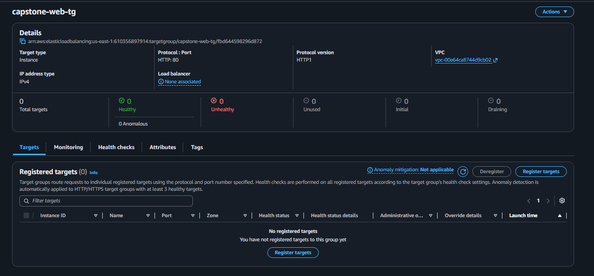

#### Health Check Configuration

| Setting | Value |
|---------|-------|
| Health check protocol | HTTP |
| Health check path | `/health.html` |
| Health check port | traffic-port |
| Interval | 30 seconds |
| Timeout | 5 seconds |
| Healthy threshold | 5 |
| Unhealthy threshold | 2 |
| Success codes | 200 |

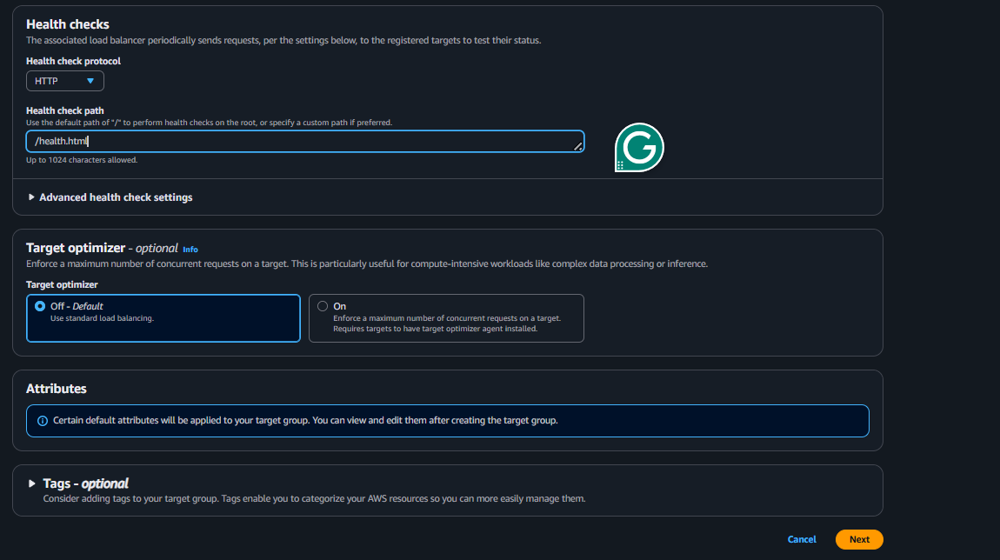

#### Review and Create

Settings were reviewed on the **Review and create** page before submitting.

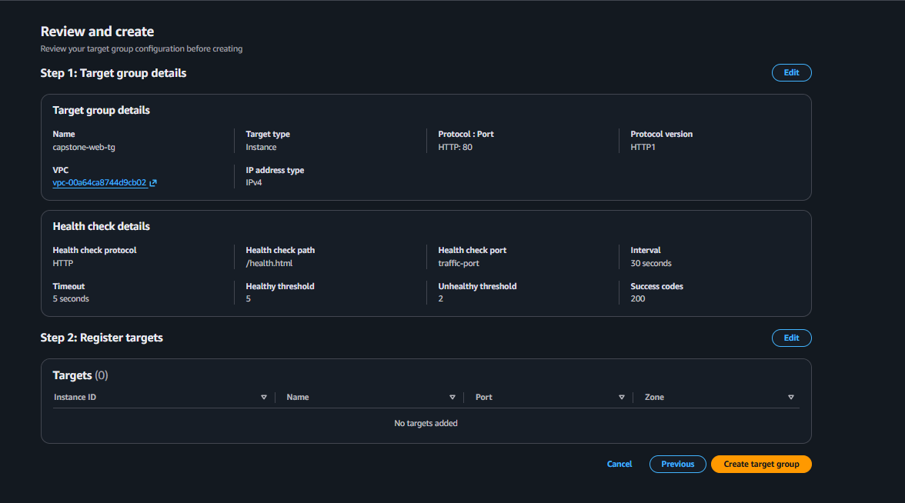

#### Target Group Created

The target group is active in **us-east-1**. A load balancer is not associated yet — that will be configured in a later step.

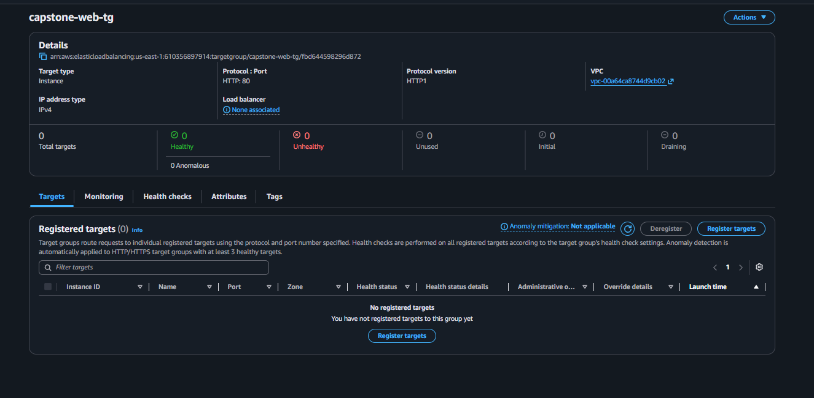

#### Register EC2 Instance

`Capstone-WebServer` was registered as a target on port **80**:

| Property | Value |
|----------|-------|
| Instance ID | `i-039e2bea39a5ec163` |
| Name | Capstone-WebServer |
| Port | 80 |
| Availability Zone | `us-east-1f` |
| Registered targets | 1 |

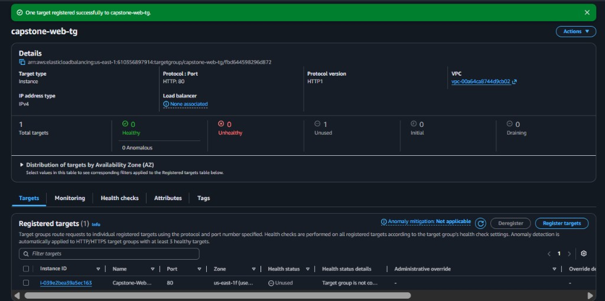

> **Note:** The target health status initially showed **Unused** because no load balancer was attached. Once the Application Load Balancer was associated, the active health checks started, and the instance state updated to **Healthy**.

### Task 3 — Configure Application Load Balancer (ALB)

| Activity | Status |
|----------|--------|
| Create internet-facing Application Load Balancer (`study-planner-alb`) | Done |
| Configure listener on Port 80 (HTTP) | Done |
| Attach default forwarding action to target group `capstone-web-tg` | Done |
| Verify ALB DNS resolves and routes traffic to the EC2 instances | Done |
| Test health checks and verify "Healthy" status in target group | Done |

An **Application Load Balancer (ALB)** was deployed to distribute incoming traffic across the backend web server instances in multiple Availability Zones.

#### Load Balancer Configuration

| Property | Value |
|----------|-------|
| Name | `study-planner-alb` |
| Scheme | Internet-facing |
| IP address type | IPv4 |
| Listener | HTTP : 80 |
| Action | Forward to `capstone-web-tg` |
| DNS Name | `study-planner-alb-1113325153.us-east-1.elb.amazonaws.com` |
| VPC | `vpc-00a64ca8744d9cb02` |

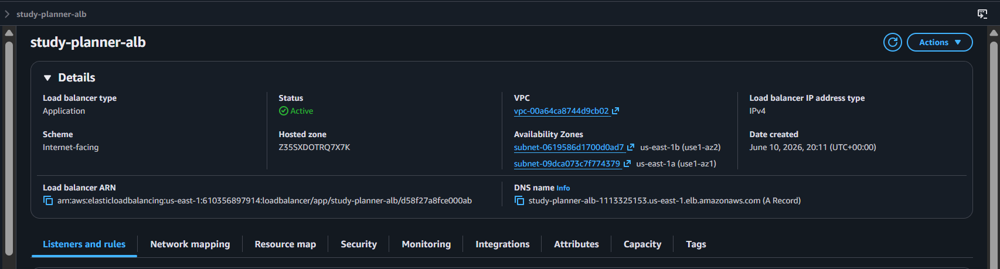

#### Live Verification of Target Health

After the ALB was created, active health probes successfully verified Nginx. The instances show a status of **Healthy**:

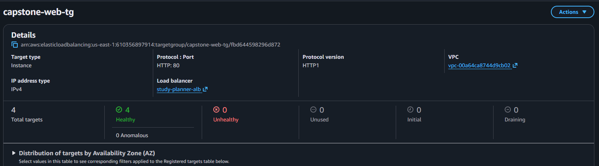

---

### Task 4 — Offload Static Assets to S3

| Activity | Status |
|----------|--------|
| Sync application code and static assets to S3 bucket | Done |
| Configure public access and CORS rules on S3 bucket | Done |
| Update application asset configuration in `app/js/config.js` | Done |

To improve performance and optimize server resource utilization, the static assets of the **Student Study Planner** are synchronized to a public S3 bucket and served directly.

#### Synchronization Command
The codebase was synchronized from the local repository to the S3 bucket using the AWS CLI:

```powershell
aws s3 sync app/ s3://capstone-static-assets-azubi-610356897914-us-east-1-an/ --profile cloud-project
```

#### S3 Bucket Settings

* **Bucket Name:** `capstone-static-assets-azubi-610356897914-us-east-1-an`
* **Static Asset Base URL:** `https://capstone-static-assets-azubi-610356897914-us-east-1-an.s3.us-east-1.amazonaws.com`
* **Logo Asset Path:** `https://capstone-static-assets-azubi-610356897914-us-east-1-an.s3.us-east-1.amazonaws.com/Azubi.png`


---

### Task 5 — Configure Auto Scaling Group (ASG)

| Activity | Status |
|----------|--------|
| Create custom AMI (`Capstone-WebServer-AMI`) from active EC2 instance | Done |
| Create Launch Template (`capstone-web-lt`) using the custom AMI | Done |
| Configure Auto Scaling Group (`capstone-web-asg`) | Done |
| Link ASG to `capstone-web-tg` to automate target registration | Done |

To handle traffic spikes and ensure high availability, an Auto Scaling Group was configured to scale instances dynamically between 1 and 3 web servers.

#### 1. Custom Amazon Machine Image (AMI)
To preserve all manual software configuration (Nginx installation, local static content, Nginx site block) completed in Task 1, a custom AMI was built:
* **Image Name:** `Capstone-WebServer-AMI`
* **AMI ID:** `ami-011769ff5f024dd25`

#### 2. Launch Template Details
* **Template Name:** `capstone-web-lt`
* **Template ID:** `lt-017bd876a4f79d816`
* **Instance Type:** `t3.micro` (Free-Tier eligible)
* **Key Pair:** `eddie-key`
* **Security Group:** `sg-04e6b787ff7ea5574` (launch-wizard-3)

#### 3. Auto Scaling Group Settings
* **ASG Name:** `capstone-web-asg`
* **Desired Capacity:** 1 instance
* **Minimum Size:** 1 instance
* **Maximum Size:** 3 instances
* **Availability Zones / Subnets:** Distributed across all 6 default subnets in `us-east-1`
* **Health Check Type:** ELB (Grace Period: 300 seconds)

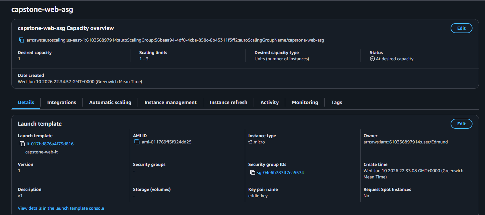

Once active, the ASG successfully launched a clone instance (`i-0a0bf40efd7d380bc`) and automatically registered it into the Load Balancer target group.

---

## Team

### AWS IAM Users

Five isolated IAM user accounts were provisioned for operational accountability. Every infrastructure change can be traced to a specific user via AWS CloudTrail.

| User | Group |
|------|-------|
| Edmund | CloudCapstoneTeam |
| Esther | CloudCapstoneTeam |
| Kwame | CloudCapstoneTeam |
| Priscilla | CloudCapstoneTeam |
| Winnifred | CloudCapstoneTeam |


### GitHub Collaborators

| Display Name | GitHub Username |
|--------------|-----------------|
| ADuah26 | ADuah26 |
| Priscilla | cilla-sys |
| Kwame Opoku | OwassJnr |
| Winn | winnhans-devops |

Repository owner: **GeekKwame**


---

## AWS Account & IAM Configuration

### Principle of Least Privilege

Instead of assigning the broad `AdministratorAccess` policy, permissions were scoped to six AWS-managed policies required for our stack: compute, load balancing, content delivery, certificate management, and storage.

| Policy | Purpose |
|--------|---------|
| `AmazonEC2FullAccess` | Provision and manage EC2 instances and security groups |
| `AmazonS3FullAccess` | Create and manage the static assets bucket |
| `AWSCertificateManagerFullAccess` | Request and manage SSL/TLS certificates for HTTPS |
| `CloudFrontFullAccess` | Configure CDN distributions |
| `ElasticLoadBalancingFullAccess` | Configure Application Load Balancer, target groups, and listeners |
| `IAMReadOnlyAccess` | View IAM configurations without modifying permissions |


### IAM User Group

Policies are attached to a centralized group called **CloudCapstoneTeam** rather than to individual users. Permission changes cascade to all team members, keeping environments consistent across the 5-person team.


### Programmatic Access

Console access and programmatic access (CLI/SDK) are decoupled. Each developer has individual access keys for local IDE and terminal use.


---

## Local Development Environment

### Toolchain Verification

The following tools were verified on local workstations before any infrastructure changes:

```powershell
aws --version
# aws-cli/2.35.0 Python/3.14.5 Windows/11 exe/AMD64

git --version
# git version 2.54.0.windows.1
```


### AWS CLI Named Profile

Each developer configures a named profile (e.g. `cloud-project`) in `~/.aws/credentials` and `~/.aws/config`, isolated from other credentials on the machine.

Verify the active identity:

```powershell
aws sts get-caller-identity --profile cloud-project
```

Expected output shape:

```json
{
    "UserId": "AIDAXXXXXXXXXXXXXXXXX",
    "Account": "610356897914",
    "Arn": "arn:aws:iam::610356897914:user/<username>"
}
```


> **Security note:** Never commit access keys or secret keys to version control. Store credentials only in local AWS config files or a secrets manager.

---

## GitHub Repository & Branching Strategy

The repository is initialized with a root `README.md` and uses a three-branch workflow:

| Branch | Purpose |
|--------|---------|
| `main` | Production-ready code (default branch) |
| `develop` | Team integration branch |
| `feature/*` | Isolated task development |

Workflow: create a feature branch from `develop` → open a Pull Request → merge to `develop` → promote to `main` when stable.


---

## Project Management (Trello)

The **AWS Capstone Project** board uses four Kanban columns:

- **Backlog** — planned work
- **In Progress** — active tasks
- **Review** — work awaiting peer review
- **Done** — completed tasks

All team members are added to the board. Phase 1 setup tasks (IAM, CLI, GitHub branches, Trello) were completed first; infrastructure tasks (EC2, S3, README) followed.


---

## AWS Infrastructure

### EC2 Web Server

| Property | Value |
|----------|-------|
| Name | Capstone-WebServer |
| Instance ID | `i-039e2bea39a5ec163` |
| Instance type | `t3.micro` (Free Tier eligible) |
| Region / AZ | `us-east-1` / `us-east-1f` |
| State | Running |
| Public IPv4 | `3.237.34.20` |

Security groups are configured to allow inbound **HTTP (port 80)** and **HTTPS (port 443)** traffic so the web server is reachable from the internet.


### S3 Static Assets Bucket

| Property | Value |
|----------|-------|
| Bucket name | `capstone-static-assets-azubi-610356897914-us-east-1-an` |
| Region | `us-east-1` (US East, N. Virginia) |
| Bucket type | General purpose |
| Namespace | Account Regional namespace |

A test static asset (`Azubi.png`, 2.8 KB, Standard storage class) was uploaded to verify bucket permissions and upload workflow.


---


## AWS Certificate Manager (ACM) SSL/TLS Certificate

### SSL/TLS Certificate Request

| Property          | Value                              |
| ----------------- | ---------------------------------- |
| Domain Name       | `capstonestudyplanner.duckdns.org` |
| Certificate Type  | Public Certificate                 |
| Validation Method | DNS Validation                     |
| AWS Service       | AWS Certificate Manager (ACM)      |
| Region            | `us-east-1` (N. Virginia)          |
| Status            | Issued                             |

An SSL/TLS certificate was requested through AWS Certificate Manager (ACM) to enable secure HTTPS communication for the application. The certificate will be used in later phases when configuring CloudFront and Application Load Balancer HTTPS listeners.

The certificate request was submitted using the custom domain:

```text
capstonestudyplanner.duckdns.org
```
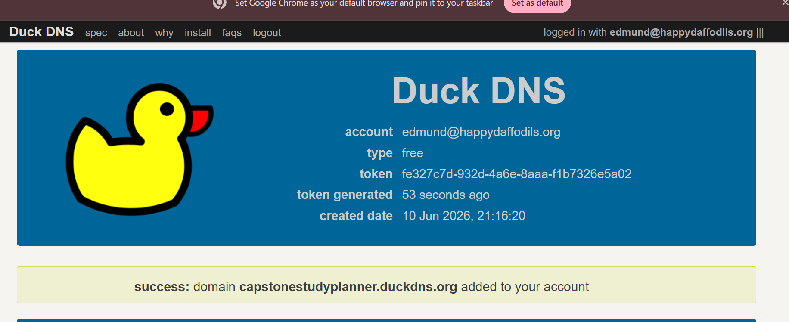

DNS validation was selected as the verification method. AWS ACM generated a CNAME validation record which was added to the domain's DNS configuration. Once AWS verified ownership of the domain, the certificate status changed to **Issued**.

### Certificate Request

The ACM wizard was used to request a public certificate for the custom domain.

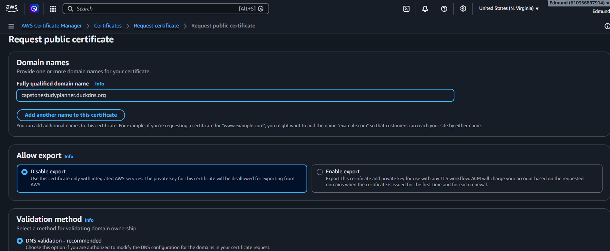
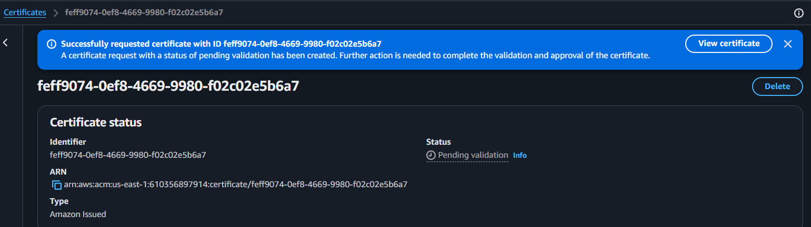

### DNS Validation

AWS generated DNS validation records that were added to the domain DNS configuration to prove ownership.


1. Accept the GitHub collaborator invitation for [aws-capstone-project](https://github.com/GeekKwame/aws-capstone-project).
2. Clone the repository and check out `develop`:
   ```bash
   git clone https://github.com/GeekKwame/aws-capstone-project.git
   cd aws-capstone-project
   git checkout develop
   ```
3. Install [AWS CLI v2](https://docs.aws.amazon.com/cli/latest/userguide/getting-started-install.html) and [Git](https://git-scm.com/downloads).
4. Configure your named AWS profile with the access keys provided by your team lead:
   ```bash
   aws configure --profile cloud-project
   ```
5. Verify identity: `aws sts get-caller-identity --profile cloud-project`
6. Join the Trello board and pull the next task from **Backlog**.

---

## Next Steps

Phase 1 and Phase 2 Tasks 1–2 establish the foundation, a live web application, and a load balancer target group. Upcoming work includes:

- Create an Application Load Balancer and attach `capstone-web-tg`
- Request and validate an ACM certificate
- Configure CloudFront
- Enable HTTPS and custom domain routing
- Automate infrastructure with IaC (future phases)

---

*Last updated: June 10, 2026 — Phase 1 complete; Phase 2 Tasks 1–2 documented.*
