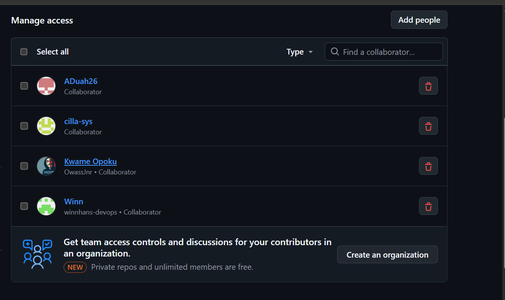
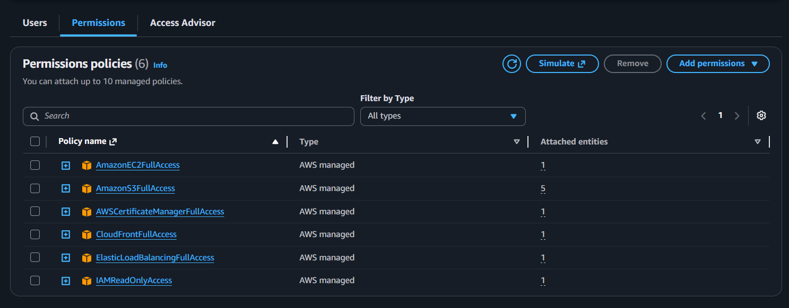
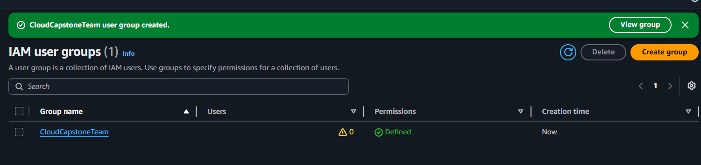
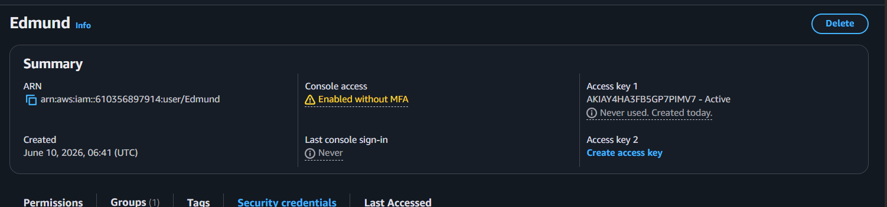
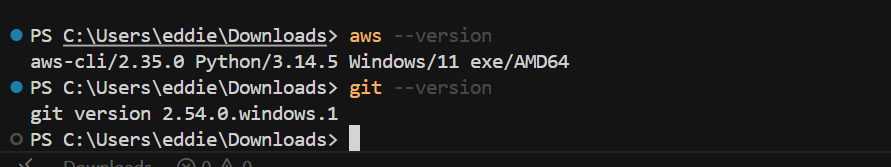
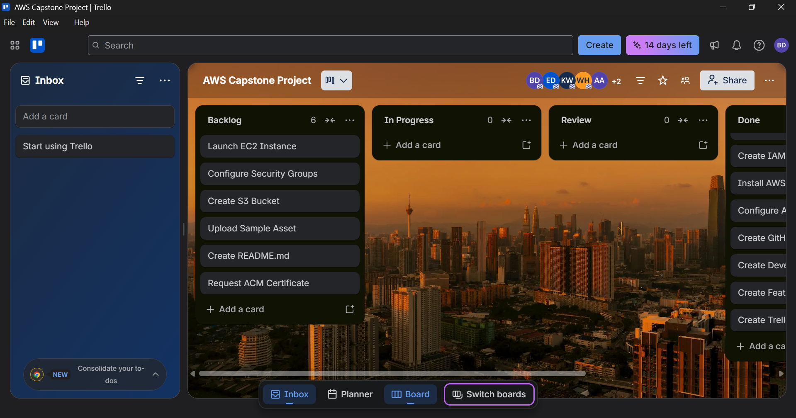
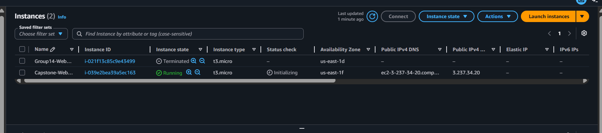
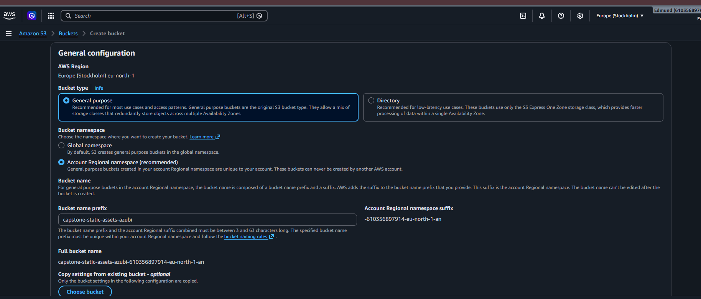

# Phase 1: Project Setup & Environment Configuration

**Challenge:** Set up all tools, accounts, and repositories for the project.

---

## Activities Completed

| Activity | Status |
|----------|--------|
| Create and configure AWS Free Tier account; set up IAM users with least-privilege permissions | Done |
| Install and configure AWS CLI locally with named profiles | Done |
| Create a GitHub repository with proper branching strategy | Done |
| Set up a Trello board with Backlog, In Progress, Review, Done columns | Done |
| Launch an EC2 instance and configure security groups for HTTP/HTTPS | Done |
| Create an S3 bucket for static assets | Done |
| Document the project environment setup in this README | Done |

---

## Team

### AWS IAM Users

Five isolated IAM user accounts were provisioned for operational accountability. Every infrastructure change can be traced to a specific user via AWS CloudTrail.

| User | Group |
|------|-------|
| Edmund | CloudCapstoneTeam |
| Esther | CloudCapstoneTeam |
| Kwame | CloudCapstoneTeam |
| Priscilla | CloudCapstoneTeam |
| Winnifred | CloudCapstoneTeam |


### GitHub Collaborators

| Display Name | GitHub Username |
|--------------|-----------------|
| ADuah26 | ADuah26 |
| Priscilla | cilla-sys |
| Kwame Opoku | OwassJnr |
| Winn | winnhans-devops |

Repository owner: **GeekKwame**



---

## AWS Account & IAM Configuration

### Principle of Least Privilege

Instead of assigning the broad `AdministratorAccess` policy, permissions were scoped to six AWS-managed policies required for our stack: compute, load balancing, content delivery, certificate management, and storage.

| Policy | Purpose |
|--------|---------|
| `AmazonEC2FullAccess` | Provision and manage EC2 instances and security groups |
| `AmazonS3FullAccess` | Create and manage the static assets bucket |
| `AWSCertificateManagerFullAccess` | Request and manage SSL/TLS certificates for HTTPS |
| `CloudFrontFullAccess` | Configure CDN distributions |
| `ElasticLoadBalancingFullAccess` | Configure Application Load Balancer, target groups, and listeners |
| `IAMReadOnlyAccess` | View IAM configurations without modifying permissions |



### IAM User Group

Policies are attached to a centralized group called **CloudCapstoneTeam** rather than to individual users. Permission changes cascade to all team members, keeping environments consistent across the 5-person team.



### Programmatic Access

Console access and programmatic access (CLI/SDK) are decoupled. Each developer has individual access keys for local IDE and terminal use.



---

## Local Development Environment

### Toolchain Verification

The following tools were verified on local workstations before any infrastructure changes:

```powershell
aws --version
# aws-cli/2.35.0 Python/3.14.5 Windows/11 exe/AMD64

git --version
# git version 2.54.0.windows.1
```



### AWS CLI Named Profile

Each developer configures a named profile (e.g. `cloud-project`) in `~/.aws/credentials` and `~/.aws/config`, isolated from other credentials on the machine.

Verify the active identity:

```powershell
aws sts get-caller-identity --profile cloud-project
```

Expected output shape:

```json
{
    "UserId": "AIDAXXXXXXXXXXXXXXXXX",
    "Account": "610356897914",
    "Arn": "arn:aws:iam::610356897914:user/<username>"
}
```


> **Security note:** Never commit access keys or secret keys to version control. Store credentials only in local AWS config files or a secrets manager.

---

## GitHub Repository & Branching Strategy

The repository is initialized with a root `README.md` and uses a three-branch workflow:

| Branch | Purpose |
|--------|---------|
| `main` | Production-ready code (default branch) |
| `develop` | Team integration branch |
| `feature/*` | Isolated task development |

Workflow: create a feature branch from `develop` → open a Pull Request → merge to `develop` → promote to `main` when stable.


---

## Project Management (Trello)

The **AWS Capstone Project** board uses four Kanban columns:

- **Backlog** — planned work
- **In Progress** — active tasks
- **Review** — work awaiting peer review
- **Done** — completed tasks

All team members are added to the board. Phase 1 setup tasks (IAM, CLI, GitHub branches, Trello) were completed first; infrastructure tasks (EC2, S3, README) followed.



---

## AWS Infrastructure

### EC2 Web Server

| Property | Value |
|----------|-------|
| Name | Capstone-WebServer |
| Instance ID | `i-039e2bea39a5ec163` |
| Instance type | `t3.micro` (Free Tier eligible) |
| Region / AZ | `us-east-1` / `us-east-1f` |
| State | Running |
| Public IPv4 | `3.237.34.20` |

Security groups are configured to allow inbound **HTTP (port 80)** and **HTTPS (port 443)** traffic so the web server is reachable from the internet.



### S3 Static Assets Bucket

| Property | Value |
|----------|-------|
| Bucket name | `capstone-static-assets-azubi-610356897914-us-east-1-an` |
| Region | `us-east-1` (US East, N. Virginia) |
| Bucket type | General purpose |
| Namespace | Account Regional namespace |

A test static asset (`Azubi.png`, 2.8 KB, Standard storage class) was uploaded to verify bucket permissions and upload workflow.




---

## AWS Certificate Manager (ACM) SSL/TLS Certificate

### SSL/TLS Certificate Request

| Property          | Value                              |
| ----------------- | ---------------------------------- |
| Domain Name       | `studentstudyplannerxyz.xyz`       |
| Certificate Type  | Public Certificate                 |
| Validation Method | DNS Validation                     |
| AWS Service       | AWS Certificate Manager (ACM)      |
| Region            | `us-east-1` (N. Virginia)          |
| Status            | Issued                             |

An SSL/TLS certificate was requested through AWS Certificate Manager (ACM) to enable secure HTTPS communication for the application. The certificate will be used in later phases when configuring CloudFront and Application Load Balancer HTTPS listeners.

The certificate request was submitted using the custom domain:

```text
studentstudyplannerxyz.xyz
```

DNS validation was selected as the verification method. AWS ACM generated a CNAME validation record which was added to the domain's DNS configuration. Once AWS verified ownership of the domain, the certificate status changed to **Issued**.

### DNS Validation

AWS generated DNS validation records that were added to the domain DNS configuration to prove ownership.


### Purpose

The ACM certificate provides:

- HTTPS encryption for all client connections
- Secure communication between users and AWS services
- Trusted SSL/TLS certificates managed automatically by AWS
- Automatic certificate renewal without manual intervention
- Compliance with security best practices for production workloads

This certificate will be attached to the CloudFront distribution and Application Load Balancer in later project phases to enforce HTTPS access to the Student Study Planner application.

After DNS validation completed successfully, the ACM certificate status changed to **Issued** and became available for use with AWS services.


---

*Last updated: June 10, 2026 — Phase 1 complete.*
