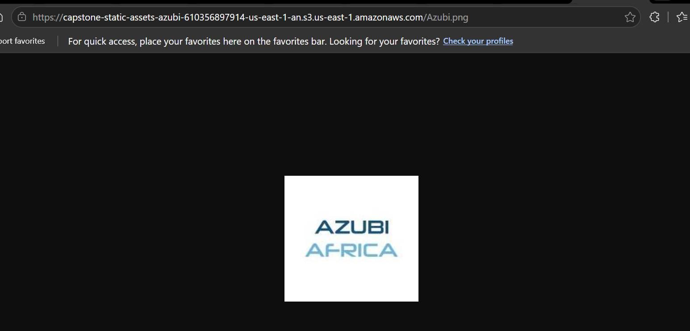

# Phase 2: Web Application Development & EC2 Deployment

**Challenge:** Build a functional frontend application, host it on the EC2 web server, configure load balancing, offload static assets to S3, and set up Auto Scaling for high availability.

---

## Host Web App on EC2 Instance

| Activity | Status |
|----------|--------|
| Develop the Student Study Planner frontend (HTML, CSS, JavaScript) | Done |
| Connect to the EC2 instance via SSH | Done |
| Install and enable Nginx on Amazon Linux 2023 | Done |
| Upload application files to the instance via SCP | Done |
| Deploy files to `/var/www/study-planner` and set Nginx ownership | Done |
| Configure Nginx to serve the app and expose a health check endpoint | Done |
| Verify the application is reachable over HTTP in a browser | Done |

A simple web application called **Student Study Planner** was developed using HTML, CSS, and JavaScript. The application allows users to manage study tasks and monitor progress through an intuitive interface.

### Web Application

The app lives in the `app/` directory and includes:

| File | Purpose |
|------|---------|
| `index.html` | Main UI — task form, progress tracker, daily motivation |
| `css/styles.css` | Layout, theming (light/dark), responsive styles |
| `js/app.js` | Task CRUD, filtering, localStorage persistence |
| `js/config.js` | S3 logo URL and app configuration |
| `health.html` | Plain-text health check response for load balancer probes |


### SSH Connection to EC2

Connected to the Capstone-WebServer instance using the team SSH key pair:

```powershell
ssh -i eddie-key.pem ec2-user@3.237.34.20
```


### Install Nginx

Nginx was installed, enabled at boot, and started on Amazon Linux 2023:

```bash
sudo dnf install -y nginx
sudo systemctl enable nginx
sudo systemctl start nginx
```


### Upload & Deploy Application Files

Application source files were copied from the local workstation to the instance using SCP, then moved into the Nginx document root:

```powershell
scp -i eddie-key.pem -r app/* ec2-user@3.237.34.20:/tmp/study-planner/
```

```bash
sudo mkdir -p /var/www/study-planner
sudo cp -r /tmp/study-planner/* /var/www/study-planner/
sudo chown -R nginx:nginx /var/www/study-planner
```


### Nginx Site Configuration

A site block was created at `/etc/nginx/conf.d/study-planner.conf`:

```nginx
server {
    listen 80;
    server_name _;
    root /var/www/study-planner;
    index index.html;

    location / {
        try_files $uri $uri/ /index.html;
    }

    location = /health.html {
        access_log off;
        return 200 "OK\n";
        add_header Content-Type text/plain;
    }
}
```

The configuration was validated and Nginx was reloaded:

```bash
sudo nginx -t
sudo systemctl reload nginx
```


### Live Verification

The application is live at **http://3.237.34.20** and serves the Student Study Planner UI over HTTP (port 80).

| Property | Value |
|----------|-------|
| Web root | `/var/www/study-planner` |
| Nginx config | `/etc/nginx/conf.d/study-planner.conf` |
| Public URL | `http://3.237.34.20` |
| Health check | `http://3.237.34.20/health.html` |

---

## Task 2 — Configure Target Group for EC2

| Activity | Status |
|----------|--------|
| Create target group (`capstone-web-tg`) with HTTP on port 80 | Done |
| Configure health check path (`/health.html`) | Done |
| Review and create the target group in the AWS Console | Done |
| Register `Capstone-WebServer` EC2 instance as a target | Done |

An **Application Load Balancer Target Group** was created to route traffic to the EC2 web server, reusing the `/health.html` endpoint for health checks.

### Target Group Settings

| Property | Value |
|----------|-------|
| Name | `capstone-web-tg` |
| Target type | Instance |
| Protocol : Port | HTTP : 80 |
| Protocol version | HTTP1 |
| VPC | `vpc-00a64ca8744d9cb02` (default) |
| IP address type | IPv4 |
| Health check path | `/health.html` |
| ARN | `arn:aws:elasticloadbalancing:us-east-1:610356897914:targetgroup/capstone-web-tg/fbd644598296d872` |


### Register EC2 Instance

`Capstone-WebServer` was registered as a target on port **80**:

| Property | Value |
|----------|-------|
| Instance ID | `i-039e2bea39a5ec163` |
| Name | Capstone-WebServer |
| Port | 80 |
| Availability Zone | `us-east-1f` |


> **Note:** The target health status initially showed **Unused** because no load balancer was attached. Once the ALB was associated, health checks started and the instance updated to **Healthy**.

---

## Task 3 — Configure Application Load Balancer (ALB)

| Activity | Status |
|----------|--------|
| Create internet-facing Application Load Balancer (`study-planner-alb`) | Done |
| Configure listener on Port 80 (HTTP) | Done |
| Attach default forwarding action to target group `capstone-web-tg` | Done |
| Verify ALB DNS resolves and routes traffic to the EC2 instances | Done |
| Test health checks and verify "Healthy" status in target group | Done |

An **Application Load Balancer (ALB)** was deployed to distribute incoming traffic across backend instances in multiple Availability Zones.

### Load Balancer Configuration

| Property | Value |
|----------|-------|
| Name | `study-planner-alb` |
| Scheme | Internet-facing |
| IP address type | IPv4 |
| Listener | HTTP : 80 |
| Action | Forward to `capstone-web-tg` |
| DNS Name | `study-planner-alb-1113325153.us-east-1.elb.amazonaws.com` |
| VPC | `vpc-00a64ca8744d9cb02` |


### Live Verification of Target Health

After the ALB was created, active health probes verified Nginx and all instances showed **Healthy** status. Accessing the ALB DNS name (`study-planner-alb-1113325153.us-east-1.elb.amazonaws.com`) in a browser confirmed the Student Study Planner loaded successfully through the load balancer.


---

## Task 4 — Offload Static Assets to S3

| Activity | Status |
|----------|--------|
| Sync application code and static assets to S3 bucket | Done |
| Configure public access and CORS rules on S3 bucket | Done |
| Update application asset configuration in `app/js/config.js` | Done |

The static assets of the **Student Study Planner** are synchronized to a public S3 bucket and served directly to improve performance.

### Synchronization Command

```powershell
aws s3 sync app/ s3://capstone-static-assets-azubi-610356897914-us-east-1-an/ --profile cloud-project
```

### S3 Bucket Settings

| Property | Value |
|----------|-------|
| Bucket Name | `capstone-static-assets-azubi-610356897914-us-east-1-an` |
| Region | `us-east-1` |
| Static Asset Base URL | `https://capstone-static-assets-azubi-610356897914-us-east-1-an.s3.us-east-1.amazonaws.com` |



---

## Task 5 — Configure Auto Scaling Group (ASG)

| Activity | Status |
|----------|--------|
| Create custom AMI (`Capstone-WebServer-AMI`) from active EC2 instance | Done |
| Create Launch Template (`capstone-web-lt`) using the custom AMI | Done |
| Configure Auto Scaling Group (`capstone-web-asg`) | Done |
| Link ASG to `capstone-web-tg` to automate target registration | Done |

An Auto Scaling Group was configured to scale instances dynamically between 1 and 3 web servers for high availability.

### Configuration Summary

| Property | Value |
|----------|-------|
| AMI Name | `Capstone-WebServer-AMI` (`ami-011769ff5f024dd25`) |
| Launch Template | `capstone-web-lt` (`lt-017bd876a4f79d816`) |
| Instance Type | `t3.micro` (Free-Tier eligible) |
| ASG Name | `capstone-web-asg` |
| Desired / Min / Max | 1 / 1 / 3 |
| Availability Zones | All 6 default subnets in `us-east-1` |
| Health Check Type | ELB (Grace Period: 300 seconds) |


Once active, the ASG launched a clone instance (`i-0a0bf40efd7d380bc`) and automatically registered it into the Load Balancer target group. The ASG activity history confirmed the scale-out event, and the EC2 dashboard showed both the original and cloned instances in a running state with healthy target group registration.

---

## AWS Certificate Manager (ACM) — Custom Domain & HTTPS

| Property | Value |
|----------|-------|
| Domain Name | `studentstudyplannerxyz.xyz` |
| Certificate Type | Public Certificate |
| Validation Method | DNS Validation |
| Region | `us-east-1` (N. Virginia) |
| Status | Issued |

An SSL/TLS certificate was requested through ACM for the custom domain to enable HTTPS in a future phase (CloudFront + ALB HTTPS listener).


---

## Next Steps

Phase 2 (Tasks 1–5) is complete. Upcoming work includes:

- Configure CloudFront CDN distribution in front of the ALB
- Enable HTTPS with the ACM certificate on the CloudFront distribution and ALB listener
- Configure custom domain routing via studentstudyplannerxyz.xyz → CloudFront
- Automate infrastructure with IaC — CloudFormation or Terraform (future phases)

---

*Last updated: June 10, 2026 — Phase 2 Tasks 1–5 documented (EC2 hosting, ALB, S3 static assets, Auto Scaling Group, ACM certificate).*
