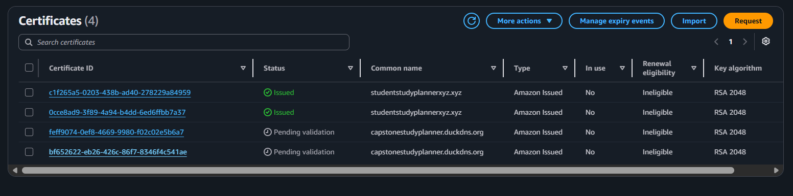
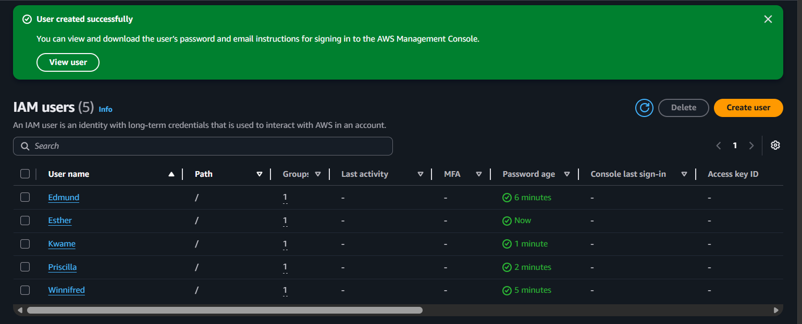
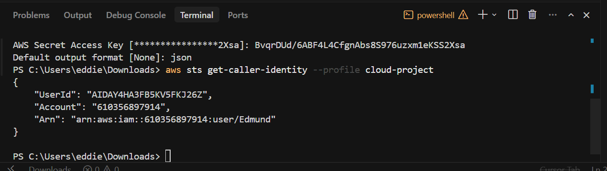
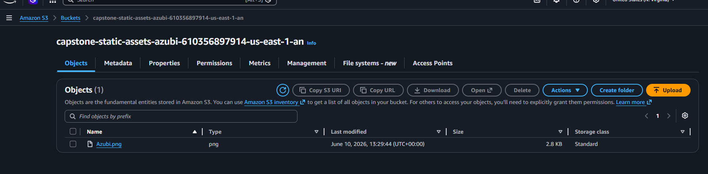
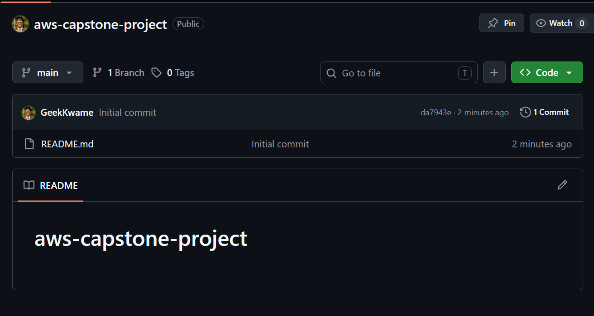

# Phase 3: CloudFront CDN & HTTPS Configuration

**Challenge:** Add a CloudFront CDN layer in front of the Application Load Balancer, enforce HTTPS using the ACM certificate, configure a custom domain via studentstudyplannerxyz.xyz, and validate the full end-to-end HTTPS flow.

---

## Activities Completed

| Activity | Status |
|----------|--------|
| Create CloudFront distribution with ALB as origin | Done |
| Attach ACM SSL/TLS certificate to CloudFront distribution | Done |
| Configure HTTP → HTTPS redirect behavior | Done |
| Link custom domain (`studentstudyplannerxyz.xyz`) to CloudFront | Done |
| Verify end-to-end HTTPS access via custom domain | Done |

---

## Task 1 — Create CloudFront Distribution

A CloudFront distribution was created with the Application Load Balancer as the origin, placing a global CDN layer in front of the EC2 web servers.

### Distribution Settings

| Property | Value |
|----------|-------|
| Origin Domain | `study-planner-alb-1113325153.us-east-1.elb.amazonaws.com` |
| Origin Protocol Policy | HTTPS Only |
| Distribution Domain | Assigned by CloudFront (e.g. `xxxx.cloudfront.net`) |
| Price Class | Use All Edge Locations |
| Alternate Domain (CNAME) | `studentstudyplannerxyz.xyz` |
| Custom SSL Certificate | ACM — `studentstudyplannerxyz.xyz` |
| Default Root Object | `index.html` |

### Steps Taken

- Navigated to **CloudFront → Create Distribution**
- Set the **Origin Domain** to the ALB DNS name
- Set **Origin Protocol Policy** to `HTTPS Only`
- Added `studentstudyplannerxyz.xyz` as an **Alternate Domain Name (CNAME)**
- Selected the ACM certificate issued for the custom domain
- Set **Viewer Protocol Policy** to `Redirect HTTP to HTTPS`

> **Note:** ACM certificates used with CloudFront must be issued in **us-east-1 (N. Virginia)** regardless of where other resources are deployed. The certificate for `studentstudyplannerxyz.xyz` was already issued in us-east-1 during Phase 2.

---

## Task 2 — ACM Certificate Attachment & Custom Domain

The ACM SSL/TLS certificate provisioned in Phase 2 was attached to the CloudFront distribution to enable HTTPS on the custom domain.

### Certificate Details

| Property | Value |
|----------|-------|
| Domain Name | `studentstudyplannerxyz.xyz` |
| Certificate Type | Public |
| Validation Method | DNS Validation |
| Region | `us-east-1` (N. Virginia) |
| Status | Issued |



### Custom Domain (studentstudyplannerxyz.xyz)

The custom domain `studentstudyplannerxyz.xyz` was pointed to the CloudFront distribution domain name. This routes all custom domain traffic through CloudFront, enabling HTTPS via the ACM certificate.

---

## Task 3 — CloudFront Behavior Configuration

### HTTP → HTTPS Redirect

The default cache behavior was configured to automatically redirect all HTTP requests to HTTPS:

| Setting | Value |
|---------|-------|
| Viewer Protocol Policy | Redirect HTTP to HTTPS |
| Allowed HTTP Methods | GET, HEAD |
| Cache Policy | CachingDisabled (for dynamic ALB content) |
| Origin Request Policy | AllViewerExceptHostHeader |

### IAM & Environment Verification

All five IAM users were verified as active with the correct group membership and permissions policies in place.



All 6 required permission policies confirmed attached to the **CloudCapstoneTeam** group:


---

## Task 4 — Infrastructure Verification

### AWS CLI Identity Verification

Each developer's AWS CLI profile was confirmed to be authenticating as the correct IAM user:

```powershell
aws sts get-caller-identity --profile cloud-project
```

```json
{
    "UserId": "AIDAY4HA3FB5KV5FKJ26Z",
    "Account": "610356897914",
    "Arn": "arn:aws:iam::610356897914:user/Edmund"
}
```



### EC2 Instance Status

The `Capstone-WebServer` EC2 instance remained running throughout Phase 3, serving traffic via the ALB and CloudFront.

| Property | Value |
|----------|-------|
| Instance ID | `i-039e2bea39a5ec163` |
| State | Running |
| Instance type | `t3.micro` |
| Availability Zone | `us-east-1f` |
| Public IPv4 | `3.237.34.20` |


### S3 Static Assets Bucket

Static assets confirmed present and accessible in S3:



---

## Task 5 — Project Management Update

### Trello Board

The Trello board was updated to reflect Phase 3 progress, with remaining infrastructure tasks tracked in Backlog.


### GitHub Repository

The repository continued to receive commits with Phase 3 documentation and configuration updates.



---

## Architecture — Final State

```
User Browser
     │
     ▼ HTTPS (443) via studentstudyplannerxyz.xyz
┌──────────────────────────────────────┐
│         CloudFront Distribution      │
│  ← ACM Certificate (TLS termination) │
│  ← HTTP redirected to HTTPS          │
│  ← Global edge caching               │
└──────────────────┬───────────────────┘
                   │ HTTPS → ALB origin
                   ▼
┌──────────────────────────────────────┐
│    Application Load Balancer         │
│    study-planner-alb (us-east-1)     │
└──────────────────┬───────────────────┘
                   │ HTTP : 80
                   ▼
┌──────────────────────────────────────┐
│    Auto Scaling Group                │
│    ├── Capstone-WebServer (EC2)       │
│    └── ASG clone instance(s)         │
│    Nginx serving Student Study Planner│
└──────────────────────────────────────┘

S3 Bucket ← Static assets (Azubi logo, images)
capstone-static-assets-azubi-610356897914-us-east-1-an
```

---

## End-to-End Flow Summary

| Layer | Service | Protocol |
|-------|---------|----------|
| DNS | Custom Domain (`studentstudyplannerxyz.xyz`) | HTTPS |
| CDN | CloudFront (global edge network) | HTTPS |
| TLS | ACM Certificate (auto-renewed) | TLS 1.2+ |
| Load Balancing | Application Load Balancer | HTTP/HTTPS |
| Compute | EC2 `t3.micro` + Auto Scaling Group | HTTP (internal) |
| Static Assets | S3 (`capstone-static-assets-azubi-...`) | HTTPS |

---

*Last updated: June 2026 — Phase 3 complete: CloudFront CDN deployed, HTTPS enforced via ACM certificate, custom domain configured.*