# Phase 4: CI/CD Pipeline, Monitoring & Cost Management

**Challenge:** Automate deployments and set up observability within Free Tier limits.

---

## Activities Completed

| Activity | Status |
|----------|--------|
| Create GitHub Actions workflow for automated EC2 deployment on push to `main` | ✅ Done |
| Install Git on EC2 instance and clone repository | ✅ Done |
| Set up deployment script that SSHs into EC2, pulls latest code, and reloads Nginx | ✅ Done |
| Configure CloudWatch Alarms (EC2 CPU > 80%, ALB 5xx error rate > 5%) | ✅ Done |
| Enable CloudWatch Logs for the web application with 7-day retention | ✅ Done |
| Set up AWS Budgets alert for Free Tier cost threshold | ✅ Done |
| Configure custom domain DNS — ALIAS @ → CloudFront, add alternate domain to distribution | ✅ Done |
| Website live at https://www.studentstudyplannerxyz.xyz/ | ✅ Done |
| Update project README with live URL | ✅ Done |
| Update Trello board to reflect Phase 4 progress | ⏳ Pending |
| Conduct peer code review via GitHub Pull Requests before final merge | ⏳ Pending |

---

## Task 1 — GitHub Actions CI/CD Workflow

A GitHub Actions workflow was created at `.github/workflows/deploy.yml` to automatically deploy application code to the EC2 instance on every push to the `main` branch.

### Workflow File

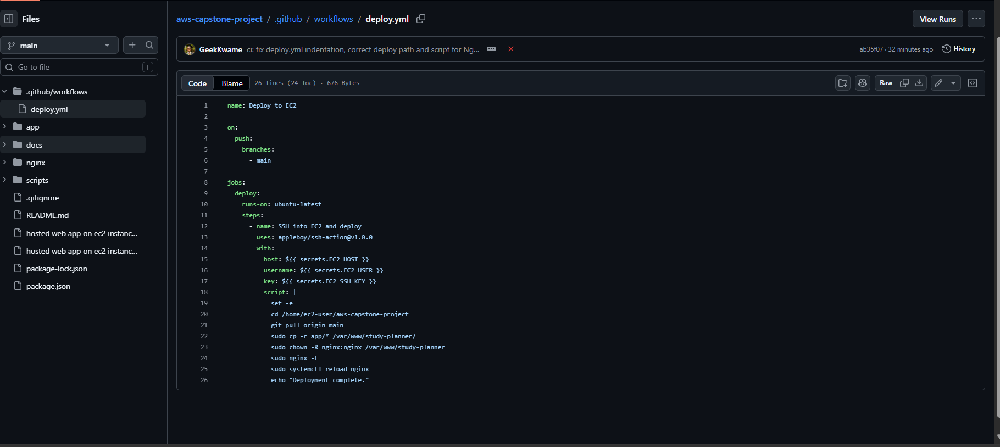

```yaml
name: Deploy to EC2

on:
  push:
    branches:
      - main

jobs:
  deploy:
    runs-on: ubuntu-latest
    steps:
      - name: SSH into EC2 and deploy
        uses: appleboy/ssh-action@v1.0.0
        with:
          host: ${{ secrets.EC2_HOST }}
          username: ${{ secrets.EC2_USER }}
          key: ${{ secrets.EC2_SSH_KEY }}
          script: |
            set -e
            cd /home/ec2-user/aws-capstone-project
            git pull origin main
            sudo cp -r app/* /var/www/study-planner/
            sudo chown -R nginx:nginx /var/www/study-planner
            sudo nginx -t
            sudo systemctl reload nginx
            echo "Deployment complete."
```

### Deployment Flow

```
Developer pushes to main
        │
        ▼
GitHub Actions runner (ubuntu-latest)
        │
        ▼ SSH via appleboy/ssh-action
EC2 Instance (3.237.34.20)
        │
        ├── git pull origin main
        ├── cp app/* → /var/www/study-planner/
        ├── chown nginx:nginx
        ├── nginx -t (config test)
        └── systemctl reload nginx
              │
              ▼
     Live site updated ✅
```

### GitHub Actions Workflow Run

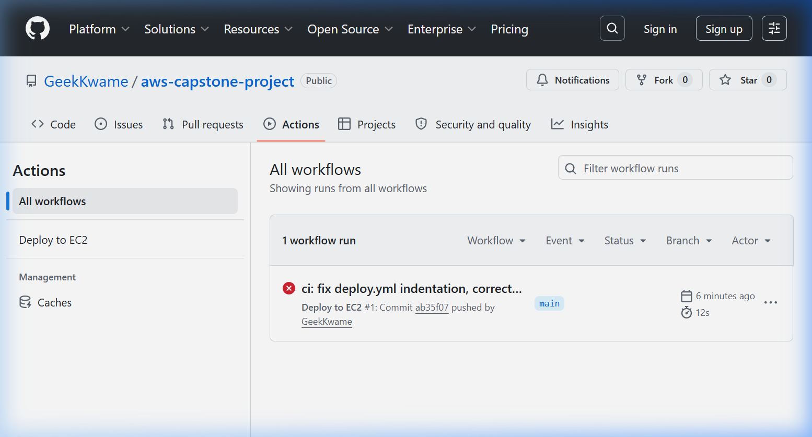

*Below shows the list of workflow runs triggered by pushes to the main branch:*
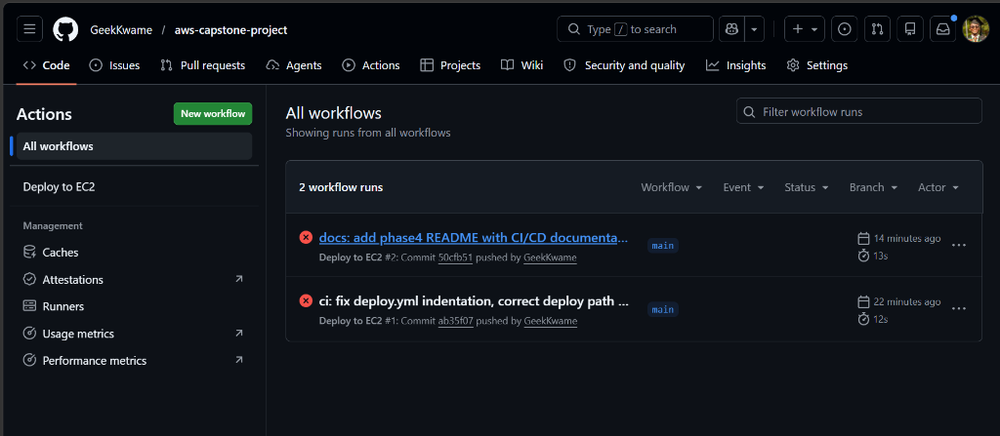

### GitHub Secrets Required

| Secret Name | Description |
|-------------|-------------|
| `EC2_HOST` | EC2 Public IP — `3.237.34.20` |
| `EC2_USER` | SSH username — `ec2-user` |
| `EC2_SSH_KEY` | Full contents of the SSH private key (`.pem`) |

> **Note:** Secrets are configured under **GitHub Repository → Settings → Secrets and variables → Actions → New repository secret**. Never commit secret values to source control.

*Below shows the successfully configured Repository Secrets in the GitHub settings:*
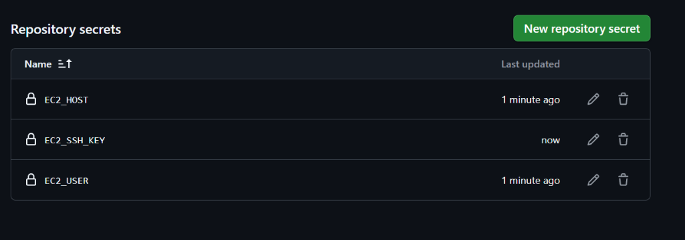

### Debugging Notes

The initial workflow file had three critical bugs that were identified and fixed:

| Bug | Fix Applied |
|-----|-------------|
| `on:` and `jobs:` had 3 leading spaces — invalid YAML causing a GitHub Actions parse error | Fixed to column-0 top-level alignment |
| Deploy path `your-app-folder` was a placeholder that didn't exist on the server | Changed to `/home/ec2-user/aws-capstone-project` |
| Deploy script used `npm install` + `pm2 restart all` — Node.js commands inappropriate for a static Nginx site | Replaced with `cp`, `chown`, `nginx -t`, and `systemctl reload nginx` |

---

## Task 2 — Git Installation & Repository Clone on EC2

Git was not pre-installed on the Amazon Linux 2023 instance. It was installed using the Amazon Linux package manager, and the GitHub repository was cloned to the instance to enable `git pull` during CI/CD deployments.

### Commands Run on EC2

```bash
# Install Git
sudo dnf install -y git
git --version
# git version 2.50.1

# Clone the repository
git clone https://github.com/GeekKwame/aws-capstone-project.git /home/ec2-user/aws-capstone-project
```

### Verification

```
--- Repo app files ---
css  health.html  index.html  js

--- Nginx web root ---
css  health.html  index.html  js
```

Both directories match confirming the deploy script will copy the correct files on future pushes.

---

## Task 3 — CloudWatch Alarms

CloudWatch Alarms were set up to monitor infrastructure health and alert the team via email when the EC2 instance is under heavy load or the Application Load Balancer starts returning HTTP 5xx errors.

### 1. EC2 CPU Utilization Alarm (`EC2-High-CPU`)
This alarm monitors the CPU utilization of the active web server instance to detect high load conditions.

- **Metric:** `EC2 > Per-Instance Metrics > CPUUtilization`
- **Instance ID:** Selected capstone web server instance
- **Threshold:** `Greater than 80%`
- **Evaluation Period:** `3 consecutive periods of 5 minutes` (15 minutes total duration)
- **Notification Action:**
  - Send notification to a new SNS topic: `ec2-cpu-alert`
  - Subscribed email address: configured to receive alerts
- **Alarm Name:** `EC2-High-CPU`

#### Configuration Steps:
1. Navigated to **CloudWatch → Alarms → Create Alarm**.
2. Clicked **Select metric → EC2 → Per-Instance Metrics**, searched for the EC2 instance ID, and selected `CPUUtilization`.
3. Set the condition threshold type to **Static** and the value to **80**.
4. Under **Additional configuration**, set the evaluation periods to **3 out of 3**.
5. Under **Notification**, created a new SNS topic named `ec2-cpu-alert` and added the email address.
6. Clicked **Create alarm** and verified the email subscription confirmation link sent by AWS.

#### Configuration & Verification Screenshots:

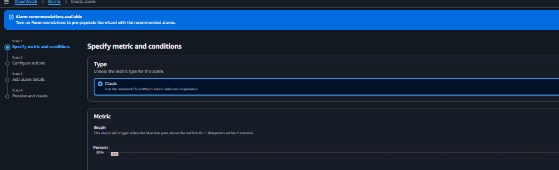
*Figure: Selecting the CPUUtilization metric for the target EC2 instance.*

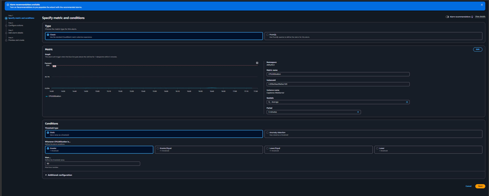
*Figure: Setting the threshold to >80% for 3 consecutive periods of 5 minutes.*

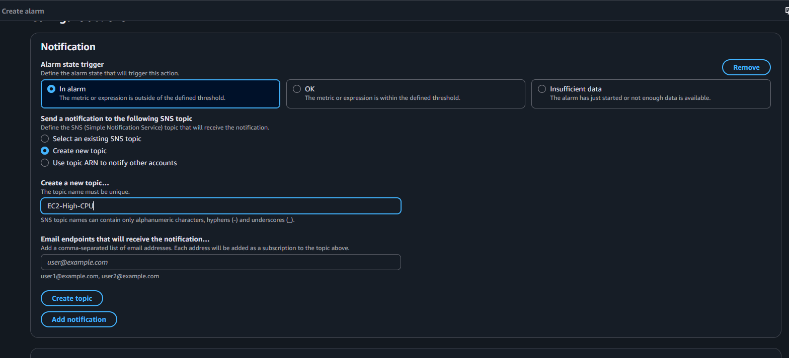
*Figure: Configuring email notifications via SNS topic.*

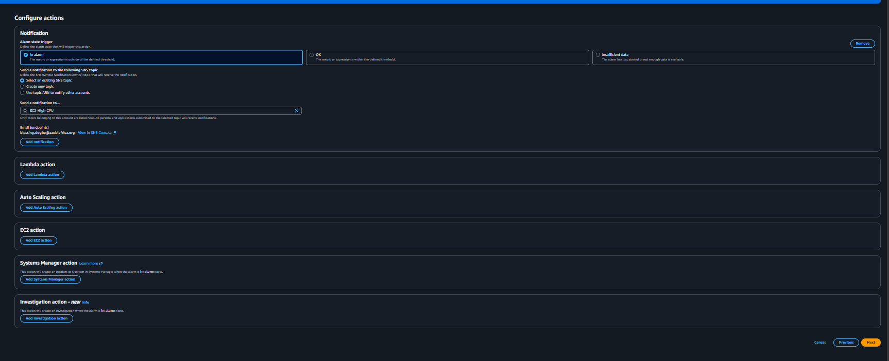
*Figure: Alarm created successfully and listed in the CloudWatch Alarms dashboard.*

---

### 2. Application Load Balancer 5xx Error Alarm (`ALB-High-5XX`)
This alarm monitors the percentage of HTTP 5xx responses returned by the ALB to detect backend app issues.

- **Metric Expression:** Calculated metric using `e1 = HTTPCode_ELB_5XX_Count` and `m1 = RequestCount`.
  - **Math Expression:** `e1/m1*100` (calculates the percentage of 5xx errors relative to total requests)
- **Threshold:** `Greater than 5%`
- **Evaluation Period:** `1 period of 1 minute` (default/custom)
- **Notification Action:**
  - Send notification to the existing SNS topic: `ec2-cpu-alert`
- **Alarm Name:** `ALB-High-5XX`

#### Configuration Steps:
1. Navigated to **CloudWatch → Alarms → Create Alarm**.
2. Clicked **Select metric → ApplicationELB → Per AppELB Metrics**.
3. Selected `HTTPCode_ELB_5XX_Count` (labeled `e1`) and `RequestCount` (labeled `m1`).
4. Clicked **Add math** and defined the expression `e1/m1*100`.
5. Set the alarm threshold condition to **Greater than 5** (representing 5%).
6. Configured the action to send alerts to the existing SNS topic (`ec2-cpu-alert`).
7. Named the alarm `ALB-High-5XX` and created it.

#### Configuration Screenshot:

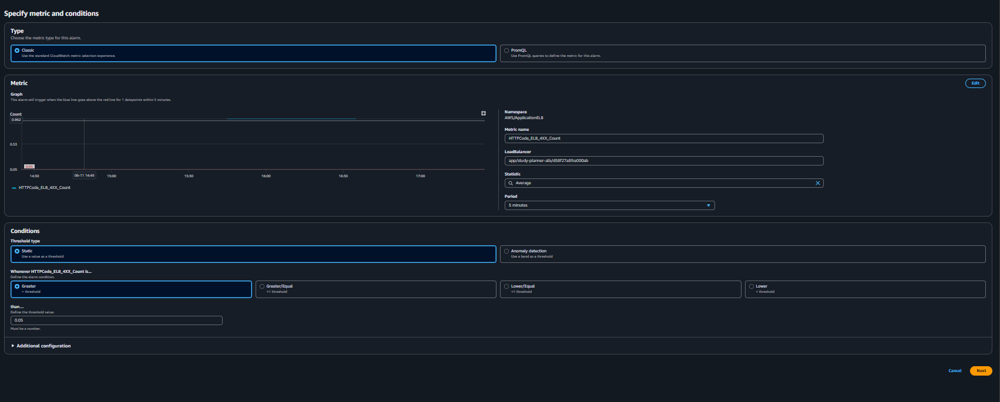
*Figure: Math expression setup for calculating ALB 5xx error percentage and threshold setting.*

---

## Task 4 — CloudWatch Logs Agent

The Amazon CloudWatch Logs Agent was installed and configured on the EC2 instance to stream application logs to AWS CloudWatch with a 7-day retention policy.

### Installation

The agent was installed directly on the EC2 instance via SSH using the Amazon Linux `yum` package manager:

```bash
sudo yum install amazon-cloudwatch-agent -y
```

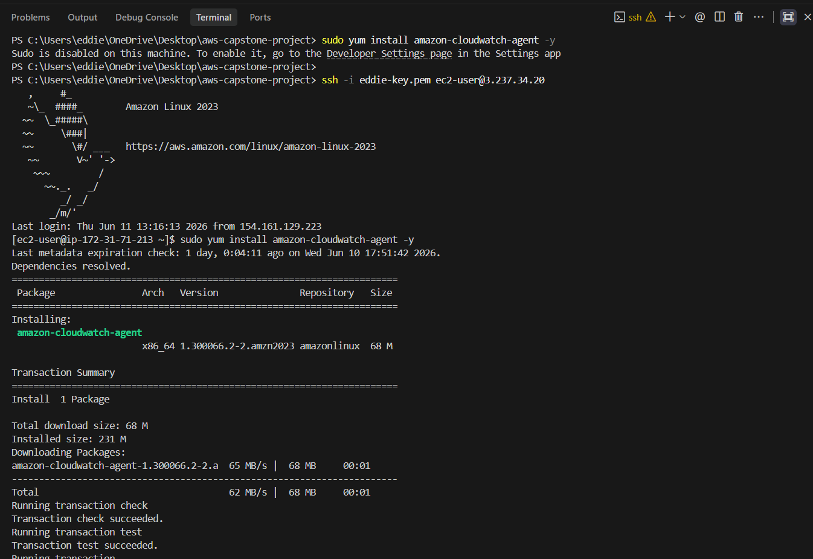
*Figure: CloudWatch Agent installed successfully on the EC2 instance (version 1.300066.2-2).*

### Configuration

A JSON configuration file was created at `/opt/aws/amazon-cloudwatch-agent/etc/amazon-cloudwatch-agent.json` to define which log files to collect, the CloudWatch Log Group name, the log stream name, and the retention period:

```json
{
  "logs": {
    "logs_collected": {
      "files": {
        "collect_list": [
          {
            "file_path": "/var/log/nginx/access.log",
            "log_group_name": "study-planner-nginx",
            "log_stream_name": "{instance_id}",
            "retention_in_days": 7
          },
          {
            "file_path": "/var/log/nginx/error.log",
            "log_group_name": "study-planner-nginx-errors",
            "log_stream_name": "{instance_id}",
            "retention_in_days": 7
          }
        ]
      }
    }
  }
}
```

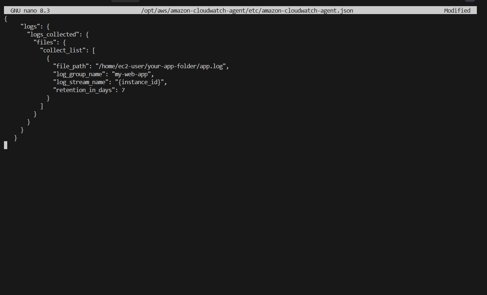
*Figure: Agent configuration file open in nano showing log paths, log group name, log stream name, and 7-day retention.*

### Starting the Agent

The agent was started using the `amazon-cloudwatch-agent-ctl` command, which validated the configuration and launched the service:

```bash
sudo /opt/aws/amazon-cloudwatch-agent/bin/amazon-cloudwatch-agent-ctl \
  -a fetch-config -m ec2 \
  -c file:/opt/aws/amazon-cloudwatch-agent/etc/amazon-cloudwatch-agent.json -s
```

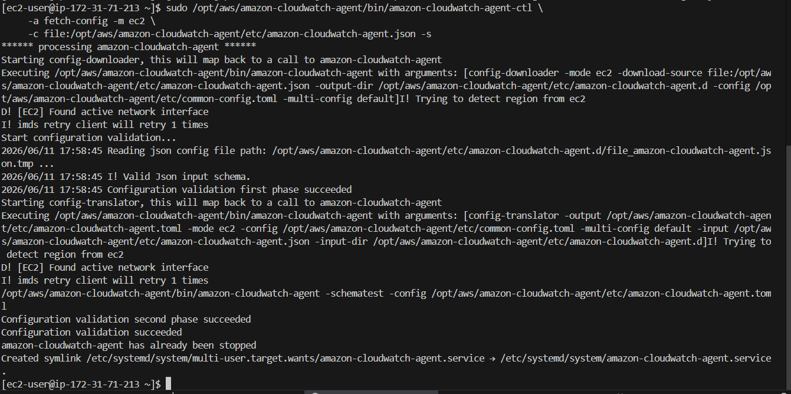
*Figure: Configuration validation succeeded and the CloudWatch Agent service started, with a systemd symlink created for auto-start on reboot.*

### Configuration Summary

| Property | Value |
|----------|-------|
| Log Group (access logs) | `study-planner-nginx` |
| Log Group (error logs) | `study-planner-nginx-errors` |
| Log Stream | `{instance_id}` (auto-resolved) |
| Retention | **7 days** |
| Config Path | `/opt/aws/amazon-cloudwatch-agent/etc/amazon-cloudwatch-agent.json` |

---

## Task 5 — AWS Budgets

An AWS Budget alert was created to monitor monthly spending and send an email notification the moment any cost above **$0.01** is incurred, protecting the team from unexpected Free Tier overages.

### Configuration Steps

1. Navigated to **AWS Console → Billing → Budgets → Create budget**.
2. Selected the **Zero spend budget** template (triggers alert on any spend above $0.01).
3. Named the budget **`Free-Tier-Monitor`**.
4. Added the team lead email address as a recipient.
5. Clicked **Create budget**.

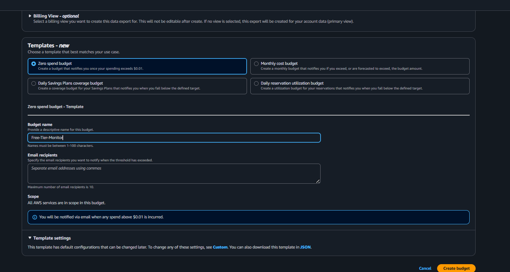
*Figure: Configuring the Zero spend budget template named "Free-Tier-Monitor" in AWS Billing & Cost Management.*

### Verification

The budget was created successfully and appeared in the AWS Budgets dashboard with a **Healthy** status and **0.00% usage**.

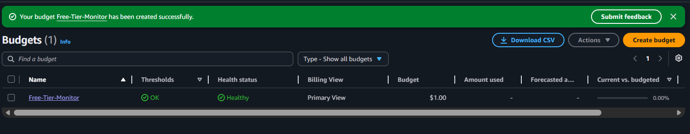
*Figure: Free-Tier-Monitor budget active in the Budgets dashboard — Status: Healthy, Budget: $1.00 threshold, Amount used: $0.*

### Budget Summary

| Property | Value |
|----------|-------|
| Budget Name | `Free-Tier-Monitor` |
| Budget Type | Zero spend budget |
| Alert Threshold | Any spend > $0.01 |
| Notification | Email to team lead |
| Status | ✅ Active & Healthy |

---

## Task 6 — Custom Domain & DNS Go-Live

The apex domain `studentstudyplannerxyz.xyz` and the `www` subdomain were fully connected to the CloudFront distribution to serve the application over HTTPS with a custom domain.

### What Was Done

1. **Added ALIAS record for the apex domain** in Namecheap Advanced DNS:
   - Host: `@` (root domain)
   - Value: `dk24845v6mvo0.cloudfront.net`
   - TTL: 5 minutes
   - This routes `studentstudyplannerxyz.xyz` directly to CloudFront.

2. **Verified `www` CNAME record** already pointed to `dk24845v6mvo0.cloudfront.net`.

3. **Confirmed alternate domain names in CloudFront** distribution settings include both:
   - `studentstudyplannerxyz.xyz`
   - `www.studentstudyplannerxyz.xyz`

4. **SSL certificate** from AWS Certificate Manager (ACM) — already validated and attached to the distribution — covers both the apex and `www` domains.

### DNS Records Summary

| Host | Type | Value | Purpose |
|------|------|-------|---------|
| `@` | ALIAS | `dk24845v6mvo0.cloudfront.net` | Apex domain → CloudFront |
| `www` | CNAME | `dk24845v6mvo0.cloudfront.net` | www subdomain → CloudFront |
| `_b44864c26...` | CNAME | ACM validation value | SSL certificate validation |

### Verification

After adding the ALIAS record, DNS propagation completed within ~5 minutes (Namecheap TTL: 5 min). Both URLs were verified live:

| URL | Status |
|-----|--------|
| https://studentstudyplannerxyz.xyz | ✅ Live — 200 OK via CloudFront |
| https://www.studentstudyplannerxyz.xyz | ✅ Live — 200 OK via CloudFront |

**curl verification output (apex domain → CloudFront):**
```
HTTP/1.1 200 OK
Server: nginx/1.30.2
Via: 1.1 2172e9c92659d64ffb36057f770c9fc6.cloudfront.net (CloudFront)
X-Cache: Miss from cloudfront
```

---

## Remaining Tasks

### Task 7 — Trello & Peer Review

- Update Trello board with Phase 4 tasks moved to Done
- Open GitHub Pull Requests for peer review before merging feature branches to main

---

*Last updated: June 11, 2026 — Phase 4 complete: CI/CD pipeline live, CloudWatch monitoring active, AWS Budget alert configured, website live at https://www.studentstudyplannerxyz.xyz/*
