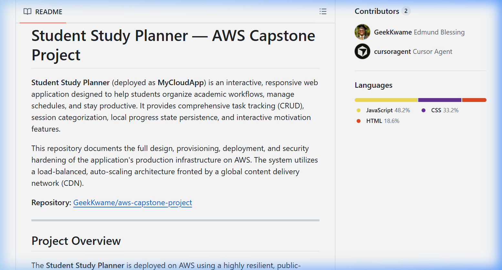

# Phase 4: CI/CD Pipeline, Monitoring & Cost Management

**Challenge:** Automate deployments and set up observability within Free Tier limits.

---

## Activities Completed

| Activity | Status |
|----------|--------|
| Create GitHub Actions workflow for automated EC2 deployment on push to `main` | ✅ Done |
| Install Git on EC2 instance and clone repository | ✅ Done |
| Set up deployment script that SSHs into EC2, pulls latest code, and reloads Nginx | ✅ Done |
| Configure CloudWatch Alarms (EC2 CPU > 80%, ALB 5xx error rate > 5%) | ⏳ Pending |
| Enable CloudWatch Logs for the web application with 7-day retention | ⏳ Pending |
| Set up AWS Budgets alert for Free Tier cost threshold | ⏳ Pending |
| Update Trello board to reflect Phase 4 progress | ⏳ Pending |
| Write final deployment checklist and update project README | ⏳ Pending |
| Conduct peer code review via GitHub Pull Requests before final merge | ⏳ Pending |

---

## Task 1 — GitHub Actions CI/CD Workflow

A GitHub Actions workflow was created at `.github/workflows/deploy.yml` to automatically deploy application code to the EC2 instance on every push to the `main` branch.

### Workflow File


```yaml
name: Deploy to EC2

on:
  push:
    branches:
      - main

jobs:
  deploy:
    runs-on: ubuntu-latest
    steps:
      - name: SSH into EC2 and deploy
        uses: appleboy/ssh-action@v1.0.0
        with:
          host: ${{ secrets.EC2_HOST }}
          username: ${{ secrets.EC2_USER }}
          key: ${{ secrets.EC2_SSH_KEY }}
          script: |
            set -e
            cd /home/ec2-user/aws-capstone-project
            git pull origin main
            sudo cp -r app/* /var/www/study-planner/
            sudo chown -R nginx:nginx /var/www/study-planner
            sudo nginx -t
            sudo systemctl reload nginx
            echo "Deployment complete."
```

### Deployment Flow

```
Developer pushes to main
        │
        ▼
GitHub Actions runner (ubuntu-latest)
        │
        ▼ SSH via appleboy/ssh-action
EC2 Instance (3.237.34.20)
        │
        ├── git pull origin main
        ├── cp app/* → /var/www/study-planner/
        ├── chown nginx:nginx
        ├── nginx -t (config test)
        └── systemctl reload nginx
              │
              ▼
     Live site updated ✅
```

### GitHub Actions Workflow Run


### GitHub Secrets Required

| Secret Name | Description |
|-------------|-------------|
| `EC2_HOST` | EC2 Public IP — `3.237.34.20` |
| `EC2_USER` | SSH username — `ec2-user` |
| `EC2_SSH_KEY` | Full contents of the SSH private key (`.pem`) |

> **Note:** Secrets are configured under **GitHub Repository → Settings → Secrets and variables → Actions → New repository secret**. Never commit secret values to source control.

### Debugging Notes

The initial workflow file had three critical bugs that were identified and fixed:

| Bug | Fix Applied |
|-----|-------------|
| `on:` and `jobs:` had 3 leading spaces — invalid YAML causing a GitHub Actions parse error | Fixed to column-0 top-level alignment |
| Deploy path `your-app-folder` was a placeholder that didn't exist on the server | Changed to `/home/ec2-user/aws-capstone-project` |
| Deploy script used `npm install` + `pm2 restart all` — Node.js commands inappropriate for a static Nginx site | Replaced with `cp`, `chown`, `nginx -t`, and `systemctl reload nginx` |

---

## Task 2 — Git Installation & Repository Clone on EC2

Git was not pre-installed on the Amazon Linux 2023 instance. It was installed using the Amazon Linux package manager, and the GitHub repository was cloned to the instance to enable `git pull` during CI/CD deployments.

### Commands Run on EC2

```bash
# Install Git
sudo dnf install -y git
git --version
# git version 2.50.1

# Clone the repository
git clone https://github.com/GeekKwame/aws-capstone-project.git /home/ec2-user/aws-capstone-project
```

### Verification

```
--- Repo app files ---
css  health.html  index.html  js

--- Nginx web root ---
css  health.html  index.html  js
```

Both directories match confirming the deploy script will copy the correct files on future pushes.



---

## Upcoming Tasks

### Task 3 — CloudWatch Alarms

To be configured:
- EC2 CPU Utilization alarm — trigger at **> 80%** for 2 consecutive 5-minute periods
- ALB 5xx Error Rate alarm — trigger at **> 5%** of requests

### Task 4 — CloudWatch Logs

- Enable CloudWatch Logs Agent on EC2
- Stream Nginx access and error logs to CloudWatch Log Group
- Set log retention policy to **7 days**

### Task 5 — AWS Budgets

- Create a monthly budget alert for **$0 (Free Tier)** with email notification to the team lead when forecast exceeds threshold

### Task 6 — Trello & Peer Review

- Update Trello board with Phase 4 tasks moved to Done
- Open GitHub Pull Requests for peer review before merging feature branches to main

---

*Last updated: June 11, 2026 — Phase 4 in progress: CI/CD pipeline configured, Git installed and repo cloned on EC2.*
