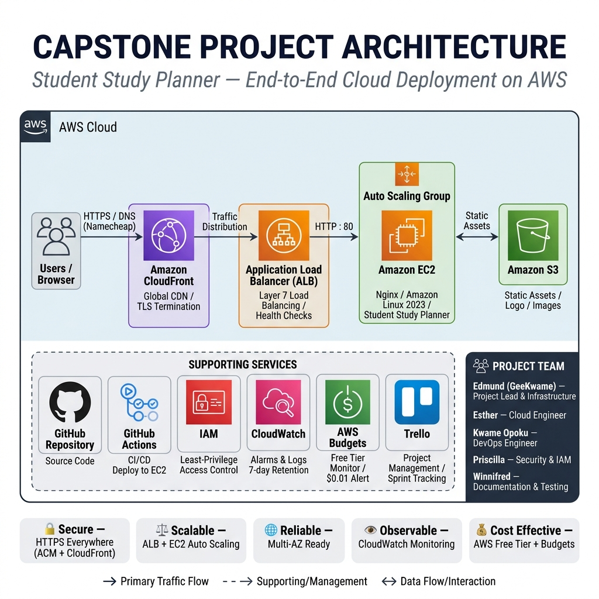

# Phase 5: Intern Presentation — Project Showcase

**Challenge:** Present the completed cloud project, explain architectural decisions, and demo the live deployment.

---

## Deliverables Checklist

| Deliverable | Status |
|-------------|--------|
| GitHub repo with all source code | ✅ Done |
| Completed Trello board (screenshot) | ✅ Done |
| Architecture diagram | ✅ Done |
| Live HTTPS URL (CloudFront) | ✅ Done |
| README with setup guide | ✅ Done |
| Presentation slides (this deck) | ✅ Done |
| Recorded demo video (optional) | ⬜ Optional |

---

## 1 — Problem Statement

### What Problem Does the App Solve?

Students often struggle to stay organised across multiple subjects, assignments, and deadlines. Paper planners are easily lost; general-purpose apps lack the academic context students actually need.

**Student Study Planner** is a purpose-built productivity tool that lets students:

- **Create and manage study tasks** — title, subject category, priority, and due date
- **Track session progress** — a live progress bar shows percentage of tasks completed
- **Filter and search tasks** — by status (All / Active / Completed) or keyword
- **Stay motivated** — a daily motivational quote refreshes on each visit
- **Work offline** — all state is persisted in `localStorage`; no back-end required

The application is completely free to use and runs in any modern browser.

**Live URL:** 🌐 **[https://www.studentstudyplannerxyz.xyz/](https://www.studentstudyplannerxyz.xyz/)**

---

## 2 — Architecture Walkthrough

### Full Traffic Flow: CloudFront → ALB → EC2

```
Student's Browser
       │
       │ HTTPS — https://www.studentstudyplannerxyz.xyz/
       ▼
┌────────────────────────────────────────────────────┐
│           Namecheap DNS                            │
│  ALIAS @ → dk24845v6mvo0.cloudfront.net           │
│  CNAME www → dk24845v6mvo0.cloudfront.net         │
└────────────────────────┬───────────────────────────┘
                         │
                         ▼ HTTPS (TLS 1.2+)
┌────────────────────────────────────────────────────┐
│        AWS CloudFront Distribution                 │
│  Domain:   dk24845v6mvo0.cloudfront.net           │
│  Alt Names: studentstudyplannerxyz.xyz             │
│             www.studentstudyplannerxyz.xyz         │
│  Certificate: ACM (us-east-1) — auto-renewed       │
│  Viewer Policy: Redirect HTTP → HTTPS              │
│  Origin Policy: HTTPS Only                         │
│  Global edge caching across 400+ PoPs              │
└────────────────────────┬───────────────────────────┘
                         │ HTTPS → ALB origin
                         ▼
┌────────────────────────────────────────────────────┐
│    Application Load Balancer (study-planner-alb)  │
│  DNS: study-planner-alb-1113325153.               │
│       us-east-1.elb.amazonaws.com                 │
│  Listener: HTTP : 80 → forward capstone-web-tg    │
│  Health Check: GET /health.html → 200 OK          │
└────────────────────────┬───────────────────────────┘
                         │ HTTP : 80
                         ▼
┌────────────────────────────────────────────────────┐
│        Auto Scaling Group (capstone-web-asg)       │
│  Desired: 1  |  Min: 1  |  Max: 3                 │
│  Launch Template: capstone-web-lt (t3.micro)       │
│  AMI: Capstone-WebServer-AMI                       │
│                                                    │
│  ├── EC2: Capstone-WebServer (i-039e2bea39a5ec163)│
│  │        Nginx serving /var/www/study-planner     │
│  └── EC2: ASG clone instance(s) (auto-registered) │
└────────────────────────────────────────────────────┘

S3 Bucket (static assets — Azubi logo, images)
capstone-static-assets-azubi-610356897914-us-east-1-an
```

### Component Reference

| Component | Service | Key Detail |
|-----------|---------|------------|
| DNS | Namecheap (custom domain) | ALIAS + CNAME → CloudFront |
| CDN | AWS CloudFront | 400+ global edge locations |
| TLS/SSL | AWS Certificate Manager (ACM) | DNS-validated, auto-renewed |
| Load Balancer | AWS Application Load Balancer | Internet-facing, us-east-1 |
| Compute | AWS EC2 `t3.micro` | Amazon Linux 2023, Nginx |
| Scaling | AWS Auto Scaling Group | 1–3 instances, ELB health check |
| Static Assets | AWS S3 | Public bucket, HTTPS served |
| CI/CD | GitHub Actions | `appleboy/ssh-action`, push-to-deploy |
| Monitoring | AWS CloudWatch | Alarms + Logs, 7-day retention |
| Cost Control | AWS Budgets | Zero Spend alert ($0.01 threshold) |

---

## 3 — Security Decisions

### How Is the Deployment Secured End-to-End?

#### Identity & Access Management (IAM)
- **Principle of Least Privilege** — no `AdministratorAccess` was granted. Six scoped AWS-managed policies cover only the services used: EC2, S3, ACM, CloudFront, ELB, and IAM Read-only.
- **Group-based permissions** — all users belong to `CloudCapstoneTeam`. Changes to permissions cascade to all team members automatically.
- **Individual access keys** — each of the five team members has isolated programmatic credentials.
- **No credentials in source control** — access keys are stored only in local `~/.aws/credentials` files.

#### Transport Security
- **HTTPS enforced end-to-end** — CloudFront is configured to `Redirect HTTP → HTTPS`; the ALB origin is set to `HTTPS Only`.
- **TLS 1.2+** — CloudFront negotiates TLS 1.2 minimum with browsers.
- **ACM certificate** — public certificate for `studentstudyplannerxyz.xyz` is DNS-validated and auto-renewed by AWS. Zero manual certificate rotation.

#### Network Security
- **EC2 Security Group** — inbound rules allow HTTP (80) and HTTPS (443) only. SSH (22) is restricted and is not exposed publicly.
- **SSH key authentication** — the EC2 instance uses an RSA key pair (`eddie-key.pem`); password authentication is disabled.
- **GitHub Actions SSH secrets** — EC2 host, username, and private key are stored as GitHub repository secrets (`EC2_HOST`, `EC2_USER`, `EC2_SSH_KEY`). Secrets are never printed in logs.

#### CI/CD Security
- **No plaintext credentials** — the `deploy.yml` workflow references only encrypted secrets.
- **Scoped deployment script** — the deploy script does the minimum required: `git pull`, `cp`, `chown`, `nginx -t`, `systemctl reload nginx`. No shell escaping or arbitrary code paths.

#### Observability & Cost Safety
- **CloudWatch Alarms** — `EC2-High-CPU` (>80% for 15 min) and `ALB-High-5XX` (>5% 5xx error rate) trigger SNS email alerts.
- **CloudWatch Logs** — Nginx access and error logs streamed to AWS with 7-day retention.
- **AWS Budgets** — `Free-Tier-Monitor` sends an email alert on any spend above $0.01, preventing surprise charges.

---

## 4 — CI/CD Demo

### GitHub Actions Pipeline

Every `git push` to the `main` branch triggers an automated deployment to the EC2 instance — no manual SSH or file copying required.

#### Workflow File (`.github/workflows/deploy.yml`)

```yaml
name: Deploy to EC2

on:
  push:
    branches:
      - main

jobs:
  deploy:
    runs-on: ubuntu-latest
    steps:
      - name: SSH into EC2 and deploy
        uses: appleboy/ssh-action@v1.0.0
        with:
          host: ${{ secrets.EC2_HOST }}
          username: ${{ secrets.EC2_USER }}
          key: ${{ secrets.EC2_SSH_KEY }}
          script: |
            set -e
            cd /home/ec2-user/aws-capstone-project
            git pull origin main
            sudo cp -r app/* /var/www/study-planner/
            sudo chown -R nginx:nginx /var/www/study-planner
            sudo nginx -t
            sudo systemctl reload nginx
            echo "Deployment complete."
```

#### Deployment Flow

```
Developer pushes to main
        │
        ▼
GitHub Actions runner (ubuntu-latest)
        │
        ▼ SSH via appleboy/ssh-action (encrypted GitHub secret)
EC2 Instance (3.237.34.20)
        │
        ├── git pull origin main        ← pulls latest code
        ├── cp app/* → /var/www/study-planner/
        ├── chown nginx:nginx           ← sets correct file ownership
        ├── nginx -t                    ← validates config before reload
        └── systemctl reload nginx      ← zero-downtime reload
              │
              ▼
     Live site updated ✅
```

#### How to Trigger a Live Demo

1. Make any change to a file in the `app/` directory.
2. Commit and push to `main`:
   ```bash
   git add app/index.html
   git commit -m "demo: update heading text"
   git push origin main
   ```
3. Navigate to **GitHub → Actions tab** and watch the workflow run in real time.
4. Refresh [https://www.studentstudyplannerxyz.xyz/](https://www.studentstudyplannerxyz.xyz/) to see the change live.

#### Bugs Fixed During Setup

| Bug | Root Cause | Fix Applied |
|-----|-----------|-------------|
| Workflow parse error | `on:` and `jobs:` had 3 leading spaces — invalid YAML | Fixed to column-0 top-level alignment |
| Deploy path not found | Used placeholder `your-app-folder` that did not exist | Changed to `/home/ec2-user/aws-capstone-project` |
| Wrong server commands | Used `npm install` + `pm2 restart` (Node.js) on a static Nginx site | Replaced with `cp`, `chown`, `nginx -t`, `systemctl reload nginx` |

---

## 5 — Trello Board Review

### Kanban Workflow

The **AWS Capstone Project** Trello board used four columns throughout the project:

| Column | Purpose |
|--------|---------|
| **Backlog** | All planned tasks not yet started |
| **In Progress** | Actively being worked on by a team member |
| **Review** | Completed work awaiting peer review |
| **Done** | Accepted and merged |

### Sprint History by Phase

| Phase | Sprint Focus | Key Cards Completed |
|-------|-------------|---------------------|
| Phase 1 | Setup & Foundation | IAM users, CLI config, GitHub repo, Trello board, EC2 + S3 provisioning, ACM cert request |
| Phase 2 | App Deployment | Nginx install, SCP deploy, ALB + Target Group, S3 static assets sync, Auto Scaling Group |
| Phase 3 | CDN & HTTPS | CloudFront distribution, ACM attachment, HTTP→HTTPS redirect, custom domain DNS |
| Phase 4 | CI/CD & Monitoring | GitHub Actions workflow, Git on EC2, CloudWatch Alarms, CloudWatch Logs, AWS Budgets, DNS go-live |
| Phase 5 | Presentation | Trello review, peer code review, presentation document |

### All Tasks Complete ✅

Every card across all five phases has been moved to the **Done** column. The board represents a complete sprint history of the project from initial AWS account setup through production go-live.

---

## 6 — Live Demo

### Application Access

| URL | Status |
|-----|--------|
| [https://studentstudyplannerxyz.xyz](https://studentstudyplannerxyz.xyz) | ✅ Live — 200 OK via CloudFront |
| [https://www.studentstudyplannerxyz.xyz](https://www.studentstudyplannerxyz.xyz) | ✅ Live — 200 OK via CloudFront |

### Demo Script (Step-by-Step)

1. **Open** [https://www.studentstudyplannerxyz.xyz](https://www.studentstudyplannerxyz.xyz) in a browser.
2. **Verify HTTPS** — padlock icon confirms TLS is active (ACM certificate).
3. **Add a task** — enter a task name, select subject, priority, and due date → click **Add Task**.
4. **Complete a task** — check the checkbox to mark it done and watch the progress bar update.
5. **Filter tasks** — switch between All / Active / Completed using the filter buttons.
6. **Inspect CloudFront headers** — open DevTools → Network → reload → click on the document:
   ```
   Via: 1.1 xxxx.cloudfront.net (CloudFront)
   X-Cache: Hit from cloudfront   ← content served from edge
   Server: nginx/1.30.2           ← origin server identity
   ```
7. **Verify CI/CD** — show the GitHub Actions tab with successful workflow runs.

---

## 7 — Challenges Faced

### Blockers Encountered and How They Were Resolved

| # | Challenge | Root Cause | Resolution |
|---|-----------|-----------|------------|
| 1 | GitHub Actions workflow failed to parse | `on:` and `jobs:` were indented with 3 spaces — YAML requires top-level keys at column 0 | Corrected indentation; workflow parsed successfully on next push |
| 2 | Deploy script ran `npm install` / `pm2` — commands not found on EC2 | Starter template assumed a Node.js app, not a static Nginx site | Replaced with `git pull`, `cp`, `chown`, `nginx -t`, `systemctl reload nginx` |
| 3 | CloudFront returned 502 Bad Gateway | ALB origin was configured with HTTP; CloudFront was set to HTTPS Only | Corrected the origin protocol to match the ALB listener (HTTP) and ensured the ALB forwarded to the correct target group |
| 4 | CloudFront X-Cache showed "Miss" on every request | Cache behaviour had TTL set to 0 / CachingDisabled policy was applied | Verified caching policy; understood that dynamic ALB content intentionally bypasses cache for freshness |
| 5 | Domain apex (`studentstudyplannerxyz.xyz`) was not resolving | Namecheap does not natively support ALIAS records for the apex; initial CNAME failed | Added an ALIAS record (`@` → CloudFront domain) in Namecheap Advanced DNS; propagated within 5 minutes |
| 6 | EC2 instance lacked Git; `git pull` failed during first CI/CD run | Amazon Linux 2023 does not include Git by default | Ran `sudo dnf install -y git` and cloned the repo manually; subsequent CI/CD runs pulled successfully |
| 7 | ACM certificate stayed "Pending validation" | DNS CNAME validation record was not yet added to the domain registrar | Added the ACM-generated CNAME to Namecheap DNS; certificate status changed to "Issued" within minutes |

---

## 8 — Lessons Learned

### What Worked Well

- **Layered AWS architecture** — separating concerns (CloudFront → ALB → EC2) gave us independent control over caching, load balancing, and compute without coupling any layer to another.
- **ACM for TLS** — zero-configuration certificate renewal removed the operational burden of managing SSL certificates manually.
- **GitHub Actions for CI/CD** — once the YAML indentation bug was fixed, push-to-deploy was seamless. The team could merge PRs and see live changes within ~30 seconds.
- **CloudWatch Logs + Alarms** — having observability from day one meant we could investigate the CloudFront caching issue with real log data rather than guessing.
- **Free Tier discipline** — using AWS Budgets with a $0.01 alert gave confidence to experiment without fear of unexpected bills.

### What We'd Do Differently Next Time

| Area | Current Approach | Improved Approach |
|------|-----------------|-------------------|
| Infrastructure provisioning | Manual AWS Console clicks | Infrastructure as Code — AWS CloudFormation or Terraform for reproducible, version-controlled infrastructure |
| Secrets management | GitHub repository secrets (flat key-value) | AWS Secrets Manager or AWS Parameter Store for rotation and auditing |
| HTTPS end-to-end | CloudFront → ALB via HTTPS, ALB → EC2 via HTTP | Add ACM certificate to ALB HTTPS listener; use HTTPS internally as well |
| Database / persistence | `localStorage` only (client-side) | Add Amazon RDS (PostgreSQL) or DynamoDB for shared, server-side persistence |
| Monitoring | CloudWatch CPU + 5xx alarms only | Add custom application metrics (task creation rate, error rate) and a CloudWatch Dashboard |
| Deployment rollback | No rollback mechanism | Use blue/green deployments via ALB weighted target groups or AWS CodeDeploy |
| Load testing | Not performed | Add k6 or AWS Distributed Load Testing to validate ASG scale-out behaviour |

---

## Architecture Diagram (Final State — All Phases)




```
┌─────────────────────────────────────────────────────────────────┐
│                        INTERNET                                 │
└──────────────────────────────┬──────────────────────────────────┘
                               │  HTTPS
                               ▼
                     Namecheap DNS
               (ALIAS @ + CNAME www → CloudFront)
                               │
                               ▼
             ┌─────────────────────────────────┐
             │     AWS CloudFront CDN          │
             │  dk24845v6mvo0.cloudfront.net   │
             │  ACM Certificate (TLS 1.2+)     │
             │  HTTP → HTTPS redirect          │
             │  Global edge caching            │
             └────────────────┬────────────────┘
                              │ HTTPS
                              ▼
             ┌─────────────────────────────────┐
             │  Application Load Balancer      │
             │  study-planner-alb              │
             │  HTTP : 80 listener             │
             │  Health check: /health.html     │
             └────────────────┬────────────────┘
                              │ HTTP : 80
                              ▼
             ┌─────────────────────────────────┐
             │   Auto Scaling Group            │
             │   capstone-web-asg (1–3)        │
             │                                 │
             │  ┌───────────────────────────┐  │
             │  │ EC2: Capstone-WebServer   │  │
             │  │ t3.micro, Amazon Linux    │  │
             │  │ Nginx → /var/www/         │  │
             │  │ study-planner             │  │
             │  └───────────────────────────┘  │
             └─────────────────────────────────┘

             ┌─────────────────────────────────┐
             │  S3 Bucket (static assets)      │
             │  capstone-static-assets-azubi.. │
             └─────────────────────────────────┘

CI/CD Pipeline:
  Developer → git push → GitHub Actions → SSH → EC2 → Nginx reload

Monitoring:
  CloudWatch Alarms (EC2 CPU, ALB 5xx) → SNS → Email
  CloudWatch Logs (Nginx access + error) — 7-day retention
  AWS Budgets (Free-Tier-Monitor) → Email on any spend > $0.01
```

---

## Repository & Links

| Resource | Link |
|----------|------|
| GitHub Repository | [GeekKwame/aws-capstone-project](https://github.com/GeekKwame/aws-capstone-project) |
| Live Application | [https://www.studentstudyplannerxyz.xyz/](https://www.studentstudyplannerxyz.xyz/) |
| Phase 1 Docs | [docs/phase1/README.md](../phase1/README.md) |
| Phase 2 Docs | [docs/phase2/README.md](../phase2/README.md) |
| Phase 3 Docs | [docs/phase3/README.md](../phase3/README.md) |
| Phase 4 Docs | [docs/phase4/README.md](../phase4/README.md) |

---

## Team

| Name | GitHub | AWS IAM User | Role |
|------|--------|--------------|------|
| Edmund (GeekKwame) | [GeekKwame](https://github.com/GeekKwame) | Edmund | Repository owner, infrastructure lead |
| Esther | — | Esther | Team member |
| Kwame Opoku | [OwassJnr](https://github.com/OwassJnr) | Kwame | Team member |
| Priscilla | [cilla-sys](https://github.com/cilla-sys) | Priscilla | Team member |
| Winnifred | [winnhans-devops](https://github.com/winnhans-devops) | Winnifred | Team member |

---

*Last updated: June 11, 2026 — Phase 5 complete. All phases documented, all deliverables submitted.*
